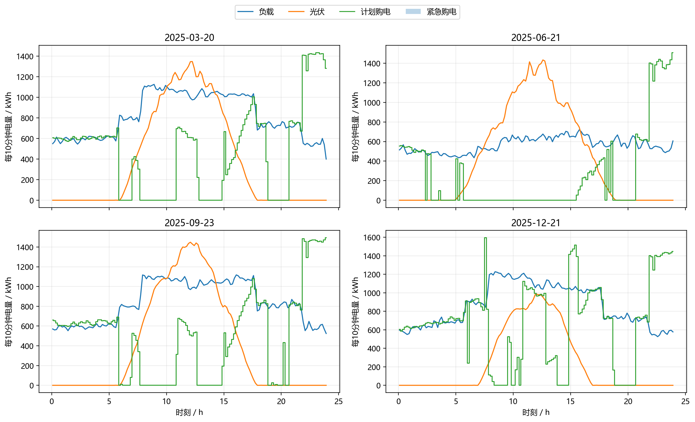

# C题问题2：基于季节自适应预测与分位数风险控制的微网日前购电模型

## 摘要

针对负载和光伏功率随日期变化、计划电量须在每日0:00一次性确定且缺口电量按实时电价5倍紧急采购的问题，本文建立“因果预测—风险修正—储能调度”三层模型。预测层以近期历史、7日滞后、岭回归和浅层LightGBM构成在线集成，并利用历史光伏有效窗口和日能量比进行季节水平校正；由于残余星期效应检验不显著且消融实验显示其增加成本，最终模型关闭周效应。风险层采用过去90天净负荷预测残差的长短窗混合分位数构造逐时段安全余量，并在开发期选得分位数0.75。决策层建立包含计划购电、充电、放电、弃光和储电状态的确定性线性规划，以日末储能水值连接相邻日期。

在2025年2月1日至12月31日334天的逐日因果回放中，负载、光伏和净负荷MAE分别为148.70、149.88和247.43 kW，净负荷nMAE为8.25%。全年计划购电2165.10万kWh，计划购电费1317.82万元，紧急购电11.01万kWh、费用68.61万元，总费用为1386.43万元。四个指定日期中，仅9月23日紧急购电6.375 kWh。全部48096个正式评价时段满足功率、储能和能量平衡约束，最大能量平衡误差为 $2.84\times10^{-13}$ kWh。风险灵敏度表明，降低分位数会增加高价紧急购电，提高分位数则增加未用计划电量，0.75在开发期总费用最低。

**关键词：** 微网调度；负荷预测；光伏预测；分位数安全余量；线性规划；储能

## 1 问题重述

外网电价在每天相同时段重复，但小区负载和光伏出力逐日变化。微网需在每日0:00制定当天144个十分钟时段的计划购电量。若执行时计划购电、光伏和储能放电仍不能满足负载，则不足部分按对应时段电价的5倍紧急采购；计划购电无论最终是否使用均按原价结算。目标是在满足用电需求和储能运行约束的前提下，使全年总购电费用尽可能低，并给出全年策略及2025年3月20日、6月21日、9月23日和12月21日的规定格式结果。

## 2 问题分析

该问题本质上是带不对称损失的日前随机决策。预测偏低会产生5倍电价的紧急采购，预测偏高则造成已付款计划电量未被利用。由于储能能够跨时段吸收偏差，直接使用无储能新闻商模型的0.80分位数会过于保守；另一方面，固定均值预测又会低估缺电风险。因此本文先生成不使用未来实际值的逐日预测，再由历史残差估计逐时段分位数安全余量，最后将风险修正后的净需求送入确定性线性规划。

已有消融结果显示，季节水平通道可同时降低预测误差和费用，而加入周效应后净负荷MAE由247.43升至247.84 kW、全年费用增加15729元；残余星期效应检验的 $p=0.967$。因此最终模型只保留光伏有效窗口与季节水平通道，不再设置独立周效应参数。

## 3 模型假设

1. 每个十分钟时段内负载、光伏功率和电价保持不变。
2. 第 $d$ 天0:00的预测和计划仅使用 $j<d$ 的历史数据；当日实际值只在日末更新模型。
3. 计划购电量非负，未使用的计划电量不能退款；缺口可通过5倍电价的紧急购电补足。
4. 储能充、放电效率均为0.9，容量范围为1200—10800 kWh，充放电功率上限均为5000 kW。
5. 同一时段不同时充放电。线性规划加入微小通量惩罚，在正电价和有效率损耗下消除无意义循环。
6. 题目未提供气象、经纬度等外生信息，季节变化只由历史负载和光伏序列感知。
7. 2025年1月1日0:00取 $E_{1,0}=E_0=6000$ kWh，此后满足跨日连续 $E_{d+1,0}=E_{d,T}$；一月参与预测预热与状态递推，正式费用评价期为2月1日至12月31日。

## 4 符号说明

| 符号 | 含义 | 单位 |
|---|---|---|
| $d$ | 日期序号，$d=1,\ldots,D$ | — |
| $t$ | 日内十分钟时段，$t=1,\ldots,T$ | — |
| $D,T$ | 全年天数与每日时段数，$D=365,T=144$ | — |
| $L_{d,t},P_{d,t}^{\mathrm{act}}$ | 小区负载功率、光伏实际功率 | kW |
| $L_{d,t}^{\mathrm{fc}},P_{d,t}^{\mathrm{fc}}$ | 日前负载预测、光伏功率预测 | kW |
| $m_{d,t}$ | 净负荷分位数安全余量 | kW |
| $x_{d,t}$ | 外网计划购电功率（全额计价） | kW |
| $y_{d,t}$ | 实际使用的计划购电功率，$0\le y_{d,t}\le x_{d,t}$ | kW |
| $r_{d,t}=x_{d,t}-y_{d,t}$ | 购电浪费功率 | kW |
| $g_{d,t}$ | 光伏实际使用功率 | kW |
| $w_{d,t}=P_{d,t}^{\mathrm{act}}-g_{d,t}$ | 光伏浪费功率 | kW |
| $u_{d,t},v_{d,t}$ | 储能充电功率、放电功率 | kW |
| $E_{d,t}$ | 时段末储电量 | kWh |
| $E_0,E_{\min},E_{\max}$ | 初始、最小和最大储电量 | kWh |
| $P_{\mathrm{st}}^{\max}$ | 最大充/放电功率 | kW |
| $e_{d,t}$ | 外网紧急购电功率 | kW |
| $c_t$ | 问题2的单日固定外网电价曲线 | 元/kWh |
| $\eta_c,\eta_d$ | 充、放电效率 | — |
| $\Delta t$ | 时段长度，$1/6$小时 | h |

## 5 因果预测模型

### 5.1 基础集成

对负载和光伏分别构造近期加权基线、岭回归和浅层LightGBM。输入只包含预测日前可见的1、2、7、14日滞后，同一时段近3、7、14日均值，日内周期、星期编码、年内日序编码以及近期水平趋势。为避免与问题3的预报时刻索引 $k$ 混淆，以 $h$ 表示候选模型编号，其近期损失为

$$
s_{h,d}=0.85\,\overline \ell_{h,d}^{\mathrm{EW}}+0.15Q_{0.75}(\ell_{h,d}),
$$

再以指数权重合成预测。训练窗随历史残差漂移强度在45—180天内自适应缩放，以减少季节切换时旧样本的影响。为保证重跑一致性，LightGBM采用固定随机种子、单线程和确定性模式。

### 5.2 光伏窗口与季节水平校正

根据历史光伏序列中连续有效发电区间估计第 $d$ 天的光伏有效窗口 $W_d$，将窗口外预测置零。随后用过去历史实际日电量与基础预测日电量之比估计水平因子

$$
\lambda_d=\operatorname{clip}\left(
1+\frac{n}{n+\kappa}\left[
\frac{\sum_{j=1}^{n}\omega_j \rho_j}{\sum_{j=1}^{n}\omega_j}-1
\right],0.85,1.15\right),
$$

其中权重随样本年龄指数衰减，记忆长度随残差漂移自适应变化。最终预测为

$$
L_{d,t}^{\mathrm{fc}}=\lambda^{L}_dL_{d,t}^{\mathrm{fc},(0)},\qquad
P_{d,t}^{\mathrm{fc}}=\lambda^{P}_dP_{d,t}^{\mathrm{fc},(0)}\mathbf 1(t\in W_d).
$$

净负荷预测为 $N_{d,t}^{\mathrm{fc}}=L_{d,t}^{\mathrm{fc}}-P_{d,t}^{\mathrm{fc}}$。净负荷允许为负，评价时不得将其裁剪为零。

### 5.3 预测结果

| 目标 | MAE/kW | RMSE/kW | nMAE | 偏差/kW |
|---|---:|---:|---:|---:|
| 负载 | 148.70 | 197.72 | 3.22% | 2.10 |
| 光伏 | 149.88 | 304.11 | 6.30% | 3.09 |
| 净负荷 | 247.43 | 362.77 | 8.25% | -0.99 |

## 6 风险控制与调度模型

### 6.1 因果分位数安全余量

令历史净负荷误差为

$$\xi_{j,t}=\left(L_{j,t}-P_{j,t}^{\mathrm{act}}\right)-N_{j,t}^{\mathrm{fc}}.$$

第 $d$ 天只使用 $j<d$ 的误差，分别计算过去90天和30天的逐时段 $q$ 分位数，并作长短窗收缩和平滑：

$$
\widetilde m_{d,t}=0.7Q_q(\xi_{d-90:d-1,t})+0.3Q_q(\xi_{d-30:d-1,t}),
$$

$$
m_{d,t}=0.35\widetilde m_{d,t}+0.65m_{d-1,t}.
$$

开发期网格比较 $q\in\{0.60,0.65,0.70,0.75,0.80,0.85\}$，最低费用对应 $q=0.75$。计划净需求为

$$N^{\mathrm{plan}}_{d,t}=N_{d,t}^{\mathrm{fc}}+m_{d,t}.$$

### 6.2 日前线性规划

在每一天给定当日初始储电量后，求解

$$
\min \sum_{t=1}^{T}c_t x_{d,t}\Delta t-\lambda_E E_{d,T}
+\varepsilon_0\sum_t(u_{d,t}+v_{d,t}+w_{d,t})\Delta t,
$$

其中 $T=144$，$\lambda_E=\eta_d\bar c$ 为日末储能水值，$\varepsilon_0$ 为消除无意义循环流的微小正数。计划阶段约束为

$$
x_{d,t}+P_{d,t}^{\mathrm{fc}}-w_{d,t}+v_{d,t}
=L_{d,t}^{\mathrm{fc}}+m_{d,t}+u_{d,t},
$$

$$
E_{d,t}=E_{d,t-1}+\eta_cu_{d,t}\Delta t-rac{v_{d,t}\Delta t}{\eta_d},
$$

$$
E_{\min}\le E_{d,t}\le E_{\max},\qquad
0\le u_{d,t},v_{d,t}\le P_{\mathrm{st}}^{\max},\qquad
x_{d,t},g_{d,t},w_{d,t}\ge0.
$$

执行阶段使用统一符号关系

$$
y_{d,t}+g_{d,t}+v_{d,t}+e_{d,t}=L_{d,t}+u_{d,t},\qquad
g_{d,t}+w_{d,t}=P_{d,t}^{\mathrm{act}},
$$

其中 $r_{d,t}=x_{d,t}-y_{d,t}\ge0$ 为购电浪费功率，$e_{d,t}$ 为外网紧急购电功率。实际总费用为

$$
C=\sum_{d=32}^{D}\sum_{t=1}^{T}
\left(c_tx_{d,t}+5c_te_{d,t}\right)\Delta t.
$$

对应地，$C_d^{\mathrm{grid}}=\sum_t c_tx_{d,t}\Delta t$，$C_d^{\mathrm{emer}}=\sum_t5c_te_{d,t}\Delta t$，且 $C_d=C_d^{\mathrm{grid}}+C_d^{\mathrm{emer}}$。

程序将功率乘以 $\Delta t$ 后保存为每十分钟电量，因此结果CSV中的购电、充放电和紧急购电单位均为kWh。

## 7 结果

### 7.1 全年结果

| 指标 | 数值 |
|---|---:|
| 正式评价期 | 2025-02-01—2025-12-31，共334天 |
| 计划购电量 | 21,650,955.78 kWh |
| 计划购电费 | 13,178,193.99 元 |
| 紧急购电量 | 110,059.39 kWh |
| 紧急购电费 | 686,116.80 元 |
| **总费用** | **13,864,310.79 元** |
| 未用计划电量 | 1,187,730.61 kWh |
| 弃光量 | 1,333,138.70 kWh |
| 发生紧急购电的日期数 | 150天 |
| 单日费用95%分位数 | 63,313.31 元 |
| 单日费用CVaR95 | 72,871.35 元 |

### 7.2 指定日期表1结果

单位：各时段和全天购电量为kWh，费用为元。

| 日期 | 10:00—10:10 | 12:00—12:10 | 14:00—14:10 | 16:00—16:10 | 18:00—18:10 | 20:00—20:10 | 全天购电量 | 全天购电费 |
|---|---:|---:|---:|---:|---:|---:|---:|---:|
| 2025-03-20 | 0.00 | 610.99 | 0.00 | 485.75 | 717.56 | 0.00 | 68,547.69 | 41,483.47 |
| 2025-06-21 | 0.00 | 0.00 | 0.00 | 226.87 | 0.00 | 0.00 | 37,341.51 | 21,373.57 |
| 2025-09-23 | 0.00 | 509.39 | 0.00 | 590.83 | 807.14 | 0.00 | 72,301.65 | 45,085.20 |
| 2025-12-21 | 0.00 | 965.40 | 0.00 | 823.34 | 722.35 | 0.00 | 96,675.62 | 61,884.57 |

### 7.3 指定日期表2结果

表中“充/放”为对应4小时内累计充电量/放电量，单位kWh。

| 日期 | 0—4时 | 4—8时 | 8—12时 | 12—16时 | 16—20时 | 20—24时 | 0:00储电量 | 24:00储电量 |
|---|---:|---:|---:|---:|---:|---:|---:|---:|
| 2025-03-20 | 107.53/153.41 | 156.98/5,626.64 | 6,243.74/2,777.38 | 4,370.95/487.24 | 277.91/5,628.92 | 10,581.34/2,934.55 | 10,800.00 | 10,800.00 |
| 2025-06-21 | 57.70/3,802.06 | 367.62/4,837.03 | 10,240.22/0.00 | 0.00/0.00 | 156.94/5,557.69 | 9,776.17/2,488.13 | 10,800.00 | 10,800.00 |
| 2025-09-23 | 12.04/9.76 | 279.41/5,544.97 | 5,920.93/1,896.62 | 3,555.60/460.72 | 0.00/5,562.13 | 10,476.06/2,923.48 | 10,800.00 | 10,800.00 |
| 2025-12-21 | 69.81/156.29 | 983.84/1,526.54 | 5,477.38/7,379.37 | 7,424.54/2,252.37 | 49.38/5,807.60 | 10,642.82/2,842.53 | 10,800.00 | 10,800.00 |

### 7.4 指定日期紧急购电

| 日期 | 紧急购电量/kWh | 紧急购电费/元 |
|---|---:|---:|
| 2025-03-20 | 0.000 | 0.00 |
| 2025-06-21 | 0.000 | 0.00 |
| 2025-09-23 | 6.375 | 43.00 |
| 2025-12-21 | 0.000 | 0.00 |

## 8 灵敏度与稳健性分析

### 8.1 风险分位数灵敏度

| $q$ | 开发期费用/元 | 留出期费用/元 | 全年费用/元 | 全年紧急购电/kWh | 紧急购电天数 |
|---:|---:|---:|---:|---:|---:|
| 0.60 | 8,917,123.60 | 5,344,179.65 | 14,261,303.25 | 267,581.15 | 255 |
| 0.65 | 8,730,343.75 | 5,287,893.88 | 14,018,237.63 | 199,406.10 | 221 |
| 0.70 | 8,620,409.52 | **5,278,910.66** | 13,899,320.18 | 149,431.21 | 188 |
| **0.75** | **8,568,601.01** | 5,295,709.78 | **13,864,310.79** | 110,059.39 | 150 |
| 0.80 | 8,585,080.60 | 5,333,178.16 | 13,918,258.75 | 80,111.20 | 124 |
| 0.85 | 8,652,894.21 | 5,400,908.26 | 14,053,802.47 | 55,392.99 | 92 |

开发期最优点为0.75，且全年费用曲线在该点附近呈U形。留出期最优点移动至0.70，表明风险偏好存在季节漂移；因此0.75应理解为当前数据下的稳健折中，而不是普适常数。若运维方对紧急采购频次另有惩罚，可提高至0.80：全年费用增加53947.96元，但紧急购电天数减少26天。

### 8.2 物理可行性

全年48096个正式评价时段中，储电量越界、充放电功率越界、同时充放电和负流量次数均为0；最大能量平衡误差为 $2.84\times10^{-13}$ kWh。因此数值解满足全部物理约束。

### 8.3 结论边界

数据只覆盖一个自然年度，无法验证跨年度季节泛化。模型没有使用天气预报，因此对突发云量变化和异常负载的尾部预测能力有限。最终方案以期望购电费用为主要目标；如果应急采购启动本身具有固定管理成本，应在目标函数中增加“每个紧急购电日”的惩罚，并重新确定风险分位数。

## 9 模型评价

模型的优点是：决策时点严格因果；季节校正只保留经消融验证有效的部分；线性规划规模小、每日求解快速；分位数余量会随预测残差自动缩放，使预测改进能够传导到决策；全部结果可以由一个主程序复现。

不足在于：外生天气缺失使极端光伏误差难以消除；全局分位数尚未针对季节、电价和储能状态分别设定；单年度结果不能证明长期稳定性。后续若获得多年或天气数据，应优先优化高价时段的净负荷低估和尾部误差，而不是继续追求普通MAE的小幅下降。

## 10 结论

最终采用“光伏有效窗口与季节水平校正＋0.75因果分位数安全余量＋确定性储能LP”。该模型在保证物理可行和因果性的前提下，将预测误差、5倍紧急购电风险和储能跨时段价值统一到日前决策中。全年总费用为13864310.79元；指定四日的结果和全年逐十分钟策略均由同一模型直接生成，可作为问题2的最终提交结果。
