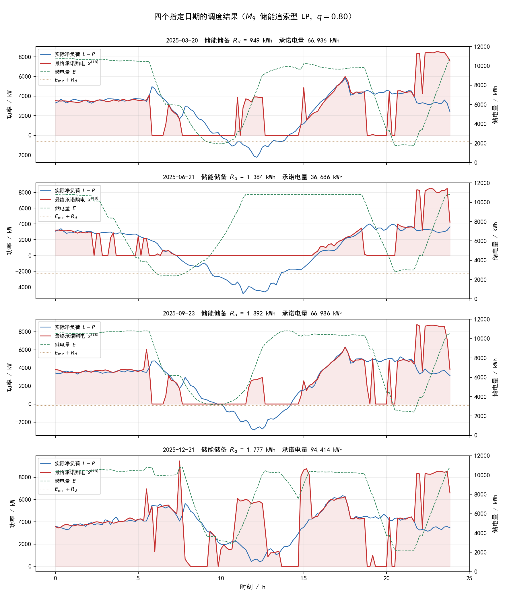

# C题问题3：储能微网多时点滚动购电的风险决策建模、方案对比与最终结果（0911综合版）

> 本版以 `问题3/模型3决策优化版` 的 **$M_9$（储能追索型 LP，$q=0.80$）** 为最终方案，把 $M_1$—$M_{10}$ 共九个决策模型作为同口径对比，并以模型3 原口径（$M_2$）作为费用锚点。
> 论文中的全部数值来自 `results/最终冻结结果.json`、`results/风险参数敏感性.csv`、`results/决策模型对比.csv`、`results/决策模型逐日结果.csv` 与三个四天结果 CSV，不使用任何旧版本数字。

---

## 摘要

问题 3 在问题 2 的基础上引入了三个新要素：**一天内有 $k=0,6,12,18$ 四个决策时刻**；**调整尚未执行的时段要按链式规则付费**（下调 $0.5c_t$、上调 $1.5c_t$）；**已执行时段不可反悔**。本文把"预测—风险—决策"三层结构搬到这一多时点滚动框架下，并系统比较风险从**不同入口**进入规划时产生的经济后果。

决策层统一为一个含购电、充放电、弃光与储电状态的线性规划，九个模型只在"风险从哪里进入规划"上不同：不进（$M_1$）、加在**负荷侧约束**（$M_2$/$M_6$）、写进**目标函数**（$M_3$/$M_4$）、用**不确定集**替代分布（$M_5$）、凭规则留量（$M_7$）、加在**储能侧约束**（$M_9$/$M_{10}$）。

两个诊断决定了最终方案。其一，**逐时段分位数叠加等价于同时施加 144 个机会约束**：$\sum_tQ_{0.80}(\xi_{\cdot,t})\Delta t$ 的年度均值为 5,085.75 kWh/日，而按日累计量取的储备 $Q_{0.80}\!\big(\sum_t\xi_{\cdot,t}\Delta t\big)$ 只有 1,441.66 kWh/日，前者是后者的 **3.53 倍**。其二，$S$ 个等权情景的两阶段随机规划，其最优解落在场景集的 $0.8S$ 个次序统计量上，$S=9$ 时离散取整推到第 8 位，**实际覆盖 $\frac89\approx0.889$ 分位**而非名义的 0.80，须 $S\ge45$ 才能落到 0.80。

据此，最终方案 $M_9$ 只做三件事：计划购电**严格按点预报下达、不加任何分位余量**；把全天不确定性压缩成**一个标量** $R_d$（历史残差日累计量的 $q$ 分位）压进储能的能量下界 $E_t\ge E_{\min}+R_d$；**不设充电空间上界**（缺额一侧赔 $4c_t$、过剩一侧赔 $c_t$，4:1 不对称，两侧同分位设界实测要多花约 37.69 万元）。风险分位数取 $q=0.80$，直接由题面 5 倍紧急电价给出的报童临界比 $C_u/(C_u+C_o)=4c/(4c+c)$ 事前确定，不依赖任何评价期回测。

在 2025 年 2 月 1 日—12 月 31 日 334 天（48,096 个时段）的因果回放中，$M_9$ 全年计划购电 20,327,202.50 kWh、电网结算费 13,290,112.92 元、紧急购电 23,286.07 kWh（134,163.30 元），**全年正式期总费用 13,424,276.22 元**，共 137 天发生紧急购电，单日费用 CVaR$_{95}$ 为 63,704.23 元。四个指定日期中 9 月 23 日与 12 月 21 日各发生一次紧急购电（6.3750 kWh 与 17.0929 kWh）。全部 48,096 个时段的能量平衡最大误差为 $6.82\times10^{-13}$ kWh，储电量与功率越界、负流量均为 0。

九个模型在同一因果回放口径下的全年总费用为：$M_{10}$（$q{=}0.70$）13,365,232.59 元；$M_9$（$q{=}0.80$，**最终方案**）13,424,276.22 元；$M_1$ 13,526,664.82 元；$M_2$/$M_6$（模型3 原口径与精确结算 MILP）13,748,164.50 元；$M_7$ 18,349,812.15 元；$M_4$ 18,567,456.94 元；$M_3$ 19,632,786.21 元；$M_5$ 23,825,590.81 元。最终方案比模型3 原口径低 **323,888.28 元（−2.36%）**，但紧急购电天数由 96 天升至 137 天——**这是一个成本—频次的权衡，不存在单一最优解**。

**关键词：** 多时点滚动决策；链式结算；报童临界比；储能储备；机会约束；随机规划；鲁棒优化；CVaR

---

## 1 问题重述与问题分析

与问题 2 只在每日 0:00 决策一次不同，问题 3 允许在 $k\in\{0,6,12,18\}$ 四个时刻各修订一次计划。修订的代价按**链式规则**结算：对第 $t$ 个时段，四个时点的承诺为 $x^{(0)}_t,x^{(6)}_t,x^{(12)}_t,x^{(18)}_t$，则

$$
\text{cost}_{d,t}=\Big[c_t\min_k x^{(k)}_{d,t}+0.5c_t\!\!\sum_{k}\Delta^{-}_{d,t,k}+1.5c_t\!\!\sum_{k}\Delta^{+}_{d,t,k}\Big]\Delta t,
$$

其中 $\Delta^{-}_k=\big(x^{(k-1)}-x^{(k)}\big)^+$ 为**下调量**（少买，罚 $0.5c_t$），$\Delta^{+}_k=\big(x^{(k)}-x^{(k-1)}\big)^+$ 为**上调量**（多买，罚 $1.5c_t$）。基准量 $\min_k x^{(k)}$ 按同时段电价 $c_t$ 全额计价；执行缺口另按 $5c_t$ 紧急采购，且已执行时段不可反悔。

把上式按承诺路径重排可见其含义：若四个承诺单调不降，则

$$
\text{cost}_{d,t}=1.5\,c_t\,x^{(18)}_{d,t}-0.5\,c_t\,x^{(0)}_{d,t},
$$

即"先少报、后补报"要为增量按 $1.5c_t$ 付费，"先多报"则已付的 $c_t$ 不可退。

该问题本质仍是**带不对称损失的日前随机决策**，只是损失的赔率更复杂：

- 少买 1 kWh 的边际惩罚为 $4c_t\Delta t$（须以 $5c_t$ 补足，而正常只需 $c_t$）；
- 多买 1 kWh 的边际浪费为 $c_t\Delta t$（已付款且不退款）；
- 若该增量是通过 $6/12/18$ 时点的**上调**实现的，则多买 1 kWh 的实际代价升到 $1.5c_t\Delta t$。

忽略储能、把每个时段视为独立报童问题，由前两条得最优安全分位数

$$
q^*=\frac{C_u}{C_u+C_o}=\frac{5c_t-c_t}{(5c_t-c_t)+c_t}=\frac{4c_t}{4c_t+c_t}=0.80 .
$$

**本文最终方案直接采用这一由 5 倍紧急电价唯一确定的临界比 $q=0.80$**：它来自题面给定的价格惩罚结构，是一个事前给定的理论值，不依赖任何对评价期的回测，因而不存在由选参引入的信息泄露。若把上调罚 $1.5c_t$ 也计入超购成本，临界比降为 $\frac{4c_t}{4c_t+1.5c_t}=0.727$，故该理论值实际落在 $[0.73,0.80]$ 区间内，本文取上端。

需要说明：储能可以跨时段吸收偏差，多买的电不必当期作废，理论上真实最优分位数可能**低于** 0.80。§10.1 的 $q$ 网格显示开发期、留出期与全年的最优点都落在 0.70，但该网格与开发期/留出期划分在本文中**只作事后对照**，不参与任何参数选择。

据此，本文的建模主线是：先做严格因果的负载/光伏预测；再把预测不确定性折算为**风险储备**；最后在储能约束下求解购电计划。**九个模型的差别只在"风险从哪个口子进入规划"。**

---

## 2 假设与符号

### 2.1 模型假设

1. 每个十分钟时段内负载、光伏功率与电价保持不变。
2. 第 $d$ 天第 $k$ 时刻的预测与计划只使用 $j<d$ 的历史实际数据，以及**当日已执行时段**（$t\le6k$）的实际值；当日尚未发生时段的真值不可见。
3. 决策时刻只能修订**尚未执行**的时段，已执行时段的购电量不可更改。
4. 计划购电量非负，未使用的计划电量不退款；缺口可通过 $5c_t$ 的紧急购电补足。
5. 小区负载为刚性需求，不可削减；不向外网售电。
6. 储能充、放电效率均为 $\eta_c=\eta_d=0.90$，储电量范围为 $[E_{\min},E_{\max}]=[1200,10800]$ kWh，最大充放电功率 $P_{\mathrm{st}}^{\max}=5000$ kW。
7. 同一时段不同时充放电。因 $\eta_c,\eta_d<1$，同充同放会损失能量；程序另加微小通量惩罚消除无意义循环流。
8. 储能初始电量取 2025 年 1 月 1 日 0:00 的 $E_{1,0}=E_0=6000$ kWh，此后按 $E_{d+1,0}=E_{d,144}$ 跨日连续递推；1 月为预热期，正式费用评价期为 2 月 1 日至 12 月 31 日。
9. 题目未提供气象、经纬度等外生信息，季节变化只由历史负载与光伏序列感知，**不使用任何天文信息**。

> **单位口径提示**：本文全部决策变量与执行量均为**每十分钟时段的电量（kWh）**，即功率与 $\Delta t$ 相乘后的结果。平衡式右端写作 $(L-P)\Delta t$、储能递推不含 $\Delta t$ 因子、充放电上界为 $P_{\mathrm{st}}^{\max}\Delta t=833.33$ kWh/时段。结果 CSV 中带 `_kw` 的列为功率，带 `_kwh` 的列为十分钟或日累计电量。该口径在 `dispatch_core.execute_slots` 与问题 2 基准执行器 `execute_actual` 之间做过逐位一致性校验（最大偏差 $<10^{-9}$）。

### 2.2 符号说明

下表沿用《C 题符号规定》的问题 3 口径；带 $\star$ 者为规定中未列出、本文为描述预测与风险层而补充的符号。

| 符号 | 含义 | 单位 |
|---|---|---|
| $d$ | 日期序号，$d=1,\dots,365$，$d=1$ 为 2025.1.1 | — |
| $t$ | 日内十分钟时段序号，$t=1,\dots,144$ | — |
| $k$ | 决策时刻的小时数，$k\in\{0,6,12,18\}$ | h |
| $\Delta t$ | 时段时长，$1/6$ h（10 min） | h |
| $c_t$ | 问题 3 的固定日内电价曲线（附件 1，每天相同），均值 0.7662 | 元/kWh |
| $5c_t$ | 紧急购电单价 | 元/kWh |
| $L_{d,t},P^{\mathrm{act}}_{d,t}$ | 负载与光伏的实际功率 | kW |
| $\widehat L^{(k)}_{d,t},\widehat P^{(k)}_{d,t}$ | 第 $d$ 天 $k$ 时刻持有的负载/光伏功率预报 | kW |
| $\xi^{(k)}_{d,t}$ | 净负荷残差，$\xi=\big(L-P^{\mathrm{act}}\big)-\big(\widehat L^{(k)}-\widehat P^{(k)}\big)$，$\xi>0$ 为缺额方向 | kW |
| $x^{(k)}_{d,t}$ | 第 $k$ 时刻承诺的第 $t$ 时段购电量（最终生效为 $x^{(18)}$） | kWh/时段 |
| $\Delta^-,\Delta^+$ | 相邻决策时刻之间的下调量、上调量 | kWh/时段 |
| $y_{d,t},r_{d,t}$ | 实际使用的计划电量、作废的计划电量，$r=x^{(18)}-y$ | kWh/时段 |
| $g_{d,t},w_{d,t}$ | 光伏实际使用量与弃光量，$g+w=P^{\mathrm{act}}\Delta t$ | kWh/时段 |
| $u_{d,t},v_{d,t}$ | 储能充电量、放电量，$0\le u,v\le P_{\mathrm{st}}^{\max}\Delta t=833.33$ | kWh/时段 |
| $e_{d,t}$ | 紧急购电量 | kWh/时段 |
| $E_{d,t}$ | 第 $d$ 天第 $t$ 时段末储电量（状态变量） | kWh |
| $E_0,E_{\min},E_{\max}$ | 初始、最小、最大储电量，$E_0=6000$ | kWh |
| $\eta_c,\eta_d$ | 充电、放电效率，均为 0.90 | — |
| $R_d^{\star}$ | 第 $d$ 天的储能能量储备，$Q_q\big(\{\sum_t\xi_{j,t}\Delta t\}_{j<d}\big)$ | kWh |
| $m_{d,t}^{\star}$ | 逐时段分位余量（$M_2$ 口径），$Q_q(\xi_{\cdot,t})$ | kW |
| $q,q^\star$ | 安全分位数与其理论值 0.80 | — |
| $S,p_s$ | 情景数与情景概率（等权 $1/S$） | — |
| $\alpha,\beta^{\star}$ | CVaR 置信水平与风险权重 | — |
| $\lambda_E^{\star}$ | 日末储能水值系数，$\lambda_E=\eta_d\bar c$ | 元/kWh |
| $\varepsilon_0^{\star}$ | 消除无意义循环流的微小通量惩罚 | 元/kWh |

问题 3 的目标函数为

$$
\min\ \sum_{d=32}^{365}\sum_{t=1}^{144}\Big[c_t\min_k x^{(k)}_{d,t}+0.5c_t\!\!\sum_k\Delta^{-}+1.5c_t\!\!\sum_k\Delta^{+}+5c_t e_{d,t}\Big]\Delta t .
$$

---

## 3 模型体系与九模型演进

九个模型共用同一套**因果信息集**（$k$ 时刻只用 $j<d$ 的历史残差与当日已执行时段）、同一套储能参数、同一套物理执行器与结算规则。**换模型 = 换 `plan` 的实现，物理与经济规则一字不动**，因此任意两个方案的费用差只来自决策。

| 代号 | 决策模型 | 建模范式 | 风险进入规划的入口 |
|---|---|---|---|
| **$M_1$** | 确定性经济调度 LP | 确定性优化 | 不进：$\widetilde L_t=\widehat L_t$ |
| **$M_2$** | 分位安全余量 LP | 确定性优化 | **约束（负荷侧）**：$\widetilde L_t=\widehat L_t+Q_{0.80}(\xi_{\cdot,t})$ |
| **$M_3$** | 两阶段随机规划 | 随机优化 | **目标**：9 个真实历史残差日场景，等权期望，紧急购电为追索 |
| **$M_4$** | 均值–CVaR 随机规划 | 风险厌恶随机优化 | **目标**：$0.5\,\mathbb E+0.5\,\mathrm{CVaR}_{0.90}$ |
| **$M_5$** | 鲁棒优化 | 鲁棒优化 | **不确定集**：取历史累计残差最大的整条日曲线求可行解 |
| **$M_6$** | 精确链式结算 MILP | 混合整数优化 | 与 $M_2$ 同余量，但用 0-1 变量精确刻画链式结算 |
| **$M_7$** | 规则型启发式 | 无优化 | 凭规则留量：净负荷跟随 + 储能在电价高低四分位充放 |
| **$M_9$** | **储能追索型 LP** | 确定性优化 + 储能储备 | **约束（储能侧）**：$E_t\ge E_{\min}+R_d$ |
| **$M_{10}$** | 储能追索型 LP（$q{=}0.70$） | 确定性优化 + 储能储备 | 同 $M_9$，分位数按开发期标定为 0.70（**仅作侧界对照**） |

演进逻辑：

1. **$M_1\to M_2$**：把点预报换成"点预报 + 逐时段分位余量"，让不确定性显式进入约束。
2. **$M_2\to M_6$**：把链式结算的凸化形式换成 0-1 精确形式，检验凸化是否损失最优性——两者全年费用相差 $1.9\times10^{-9}$ 元，说明**凸化是紧的**。
3. **$M_2\to M_3,M_4$**：把余量从约束挪进目标，用场景与 CVaR 描述尾部。
4. **$M_2\to M_5$**：放弃分布，只要求对历史最坏日可行。
5. **$M_7$**：作为"不做优化"的对照下界。
6. **$M_2\to M_9$**：**把风险从负荷侧搬到储能侧**——不再多买电，而是让储能在缺额时多放一点。这是全篇的核心结论。
7. **$M_9\to M_{10}$**：把分位数从理论值 0.80 降到开发期最优点 0.70，量化"事后标定"能带来多少收益（−0.44%）。

> **关于 $M_2$ 与模型3 的关系**：$M_2$ 就是模型3 的原始决策口径。在同一执行器下复现，$M_2$ 全年费用 13,748,164.499748461 元与 `问题3/模型3` 冻结值 13,748,164.499748463 元一致（差 $2\times10^{-9}$ 元），故本文以 $M_2$ 作为**费用锚点**。

---

## 4 因果预测层

预测层与问题 2 同源，但在问题 3 中必须**逐决策时刻**给出覆盖剩余时段的预报，且 $k>0$ 时要利用当日已执行时段的信息。

### 4.1 负载：日内阻尼修正

$$
\widehat L^{(k)}_{d,t}=\Big[1+\gamma\Big(\tfrac{\sum_{t\le6k}L_{d,t}}{\sum_{t\le6k}\widehat L^{(0)}_{d,t}}-1\Big)\Big]\widehat L^{(0)}_{d,t},\qquad \gamma=0.5,\ k>0 ;
$$

$k=0$ 时 $\widehat L^{(0)}$ 由问题 2 的在线集成给出。该修正是**因果**的：分子只含已执行时段的实际值。

### 4.2 光伏：发布时刻 × 日内小时的因果线性融合

对每个发布时刻 $k$ 与日内小时 $h$，只在 $j<d$ 上拟合

$$
P^{\mathrm{act}}_{j,t}=a^{(k)}_hP^{(k)}_{j,t}+b^{(k)}_h\widehat P^{\mathrm{own}}_{j,t}+c^{(k)}_h+\varepsilon,\qquad j<d,
$$

再外推到第 $d$ 天。**只在 $j<d$ 上拟合 → 因果，看不到当天真值**；不同 $k$ 使用不同系数，故越晚的决策时刻光伏预报越准。

### 4.3 残差的定义

$$
\xi^{(k)}_{d,t}=\big(L_{d,t}-P^{\mathrm{act}}_{d,t}\big)-\big(\widehat L^{(k)}_{d,t}-\widehat P^{(k)}_{d,t}\big),\qquad t>6k,
$$

$\xi>0$ 表示实际净负荷高于预报，即**缺额方向**。第 $d$ 天 $k$ 时刻可用的残差样本为 $\{\xi^{(k)}_{j,\cdot}\}_{j<d}$，不含当日任何真值。**全部风险模型做的事情只有一件：拿这份历史 $\xi$ 决定留多少缓冲。**

### 4.4 预测精度

正式评价期（2025-02-01—12-31，334 天，48,096 个时段）0:00 预报的平均绝对误差：

| 目标 | MAE/kW |
|---|---:|
| 负载 | 149.53 |
| 光伏 | 140.71 |
| 净负荷 | 238.98 |

---

## 5 风险控制层：两条诊断决定最终方案

### 5.1 诊断一：逐时段分位叠加 = 144 个同时生效的机会约束

$M_2$ 对**每个时段**分别取 0.80 分位：

$$
m_{d,t}=Q_{0.80}\big(\{\xi_{j,t}\}_{j<d}\big),\qquad \widetilde L_{d,t}=\widehat L_{d,t}+m_{d,t}.
$$

这等于要求"144 个时段**同时**不发生缺额"，联合覆盖远高于 0.80。实测两口径的年度均值：

$$
\underbrace{\sum_{t=1}^{144}Q_{0.80}(\xi_{\cdot,t})\Delta t}_{\text{5,085.75 kWh/日}}\ \ \text{vs}\ \ \underbrace{Q_{0.80}\Big(\sum_{t=1}^{144}\xi_{\cdot,t}\Delta t\Big)}_{\text{1,441.66 kWh/日}}\ \Longrightarrow\ \textbf{3.53 倍} .
$$

缺口在**日**尺度上高度相关（同一天要么整体偏多、要么整体偏少），按**时段**施加余量是口径错配：$M_2$ 全年为此多买 1,569,734 kWh，只换回 7,453 kWh 的紧急购电（见 §8.4）。这也是最终方案把不确定性压成**一个标量** $R_d$ 的直接原因。

### 5.2 诊断二：$S$ 个等权情景的随机规划，隐含分位不是目标值

对第 $t$ 个时段，两阶段 LP 的一阶条件（多买 1 kWh 花 $c_t$，少买 1 kWh 的追索代价是 $\frac1S\sum_s5c_t\mathbf 1\{r_s>x\}$）为

$$
c_t=\frac{5c_t}{S}\cdot\#\{s:r_s>x\}\ \Longrightarrow\ \#\{s:r_s>x\}=\frac{S}{5},
$$

即解落在场景集的第 $S-S/5=0.8S$ 个次序统计量上。$S=9$ 时 $0.8\times9=7.2$，离散取整推到第 8 位 → **实际覆盖 $\frac89\approx0.889$ 分位**。要真正落到 0.80，须 $S\ge45$。

> 这条诊断也解释了 §9.1 中一处与直觉相反的结果：把 $M_3/M_4$ 的情景集从"逐时段分位拼出的合成曲线"换成**真实整条历史残差日曲线**后，两者反而更贵（$M_3$：14,335,209.50 → 19,632,786.21 元）。真实日曲线保留了日内相关性、尾部更厚，$S=9$ 的次序统计量因而落到更保守的位置；合成曲线各分量同时取分位，是一条"比任何真实日都平"的曲线，反而低估了需求。

### 5.3 风险储备 $R_d$：把全天不确定性压成一个标量

$$
R_d=Q_q\Big(\Big\{\textstyle\sum_{t=1}^{144}\xi_{j,t}\Delta t\Big\}_{j<d}\Big),
$$

即**日累计残差**的 $q$ 分位，只用 $j<d$ 的样本，因果。实测 $R_d$ 全年均值 1,441.66 kWh、最小 153.22 kWh、最大 1,945.08 kWh，均值仅占可用容量（$E_{\max}-E_{\min}=9600$ kWh）的 15.0%。它与 §5.1 的逐时段口径相差 3.53 倍，正是两个方案的储备成本之差。

### 5.4 为什么只设能量下界、不设充电空间上界

两侧的赔率是 **4:1 不对称**的：缺额一侧每 kWh 赔 $4c_t$，过剩一侧每 kWh 只赔 $c_t$。若两侧按同一分位设界（$E_t\le E_{\max}-R'_d$），等于假装赔率是 1:1，会逼储能在低价时段白白放电以腾出充电空间。实测加上上界后全年费用由 13,424,276.22 元升至约 13,801,180 元，**代价约 37.69 万元（+2.81%）**，故最终方案不设上界。

### 5.5 爬坡可达性修正

储备下界 $E_{\min}+R_d$ 可能高于当前储电量，而一个时段最多爬升 $\eta_cP_{\mathrm{st}}^{\max}\Delta t=750$ kWh，直接施加会让 LP 不可行。故下界延后

$$
t_{\mathrm{lo}}=\Big\lceil\frac{E_{\min}+R_d-E_{\text{start}}}{\eta_cP_{\mathrm{st}}^{\max}\Delta t}\Big\rceil
$$

个时段生效；同时把 $R_d$ 截断在 $(E_{\max}-E_{\min})/2=4800$ kWh 以内，保证可行解存在。

---

## 6 决策层：储能追索型 LP（最终方案 $M_9$）

给定当前储电量与 $k$ 时刻的信息集，对**尚未执行**的时段求解

$$
\min\ \ \sum_{t>6k}\Big[c_t\,x_t+0.5c_t\,\Delta^-_t+1.5c_t\,\Delta^+_t+5c_t\,e_t\Big]-\lambda_E E_{144}+\varepsilon_0\!\!\sum_t(u_t+v_t+w_t),
$$

**功率平衡**（$t>6k$）：

$$
x_t+\widehat P_t-w_t+v_t=\widehat L_t+u_t,
$$

**储能递推与上下限**（含 §5.5 的爬坡修正）：

$$
E_t=E_{t-1}+\eta_cu_t-\frac{v_t}{\eta_d},\qquad
\max\big(E_{\min},\,E_{\min}+R_d\cdot\mathbf 1[t\ge t_{\mathrm{lo}}]\big)\le E_t\le E_{\max},
$$

$$
0\le u_t,v_t\le833.33,\qquad 0\le w_t\le\widehat P_t,\qquad x_t\ge0 .
$$

其中 $\lambda_E=\eta_d\bar c$ 为日末储能水值，避免末时段无意义抛空。**注意 $\widehat L_t$ 与 $\widehat P_t$ 均未加任何余量**——$M_9$ 的风险全部由 $E_t\ge E_{\min}+R_d$ 承担。

**执行阶段**（用当日实际值结算）：

$$
y_t+g_t+v_t+e_t=L_t+u_t,\qquad g_t+w_t=P^{\mathrm{act}}_t,\qquad r_t=x^{(18)}_t-y_t\ge0 .
$$

**多时点滚动**：$k=0,6,12,18$ 各解一次，每次只优化 $t>6k$，前一时点的承诺通过 `ref` 进入目标，使增量按 $\Delta^\pm$ 计费——实现上把 $x$ 按 $0.5c_t$ 计价、把上调量按 $(1.5c_t-0.5c_t)=1.0c_t$ 计价，等效于对最终承诺按链式规则收费。

---

## 7 结果

### 7.1 全年结果

| 指标 | 数值 |
|---|---:|
| 正式评价期 | 2025-02-01—2025-12-31，共 334 天（48,096 个时段） |
| 计划购电量 | 20,327,202.50 kWh |
| 计划购电费 $C^{\mathrm{plan}}$ | 12,717,110.97 元 |
| 调整购电费 $C^{\mathrm{adjust}}$ | 573,001.95 元（全部为上调超购费，违约费 0.00 元） |
| 电网结算费 $C^{\mathrm{grid}}$ | 13,290,112.92 元 |
| 紧急购电量 | 23,286.07 kWh |
| 紧急购电费 $C^{\mathrm{emer}}$ | 134,163.30 元 |
| **全年总费用 $C$** | **13,424,276.22 元** |
| 未用计划电量（$\sum r\Delta t$） | 488,848.85 kWh |
| 弃光量（$\sum w\Delta t$） | 1,257,576.64 kWh |
| 发生紧急购电的日期数 | 137 天（455 个时段） |
| 单日费用 95% 分位数 | 61,620.82 元 |
| 单日费用 CVaR$_{95}$ | 63,704.23 元 |
| 年末储电量 | 9,686.71 kWh |

四个指定日期中，3 月 20 日与 6 月 21 日无需紧急购电；9 月 23 日与 12 月 21 日各发生一次。全年链式结算与两元结算结果完全相同（差额 0.00 元），因为 $M_9$ 的承诺路径单调不降，违约费为 0。

### 7.2 指定日期表 1 结果

单位：各时段与全天购电量为 kWh，费用为元。

| 日期 | 10:00—10:10 | 12:00—12:10 | 14:00—14:10 | 16:00—16:10 | 18:00—18:10 | 20:00—20:10 | 全天购电量 | 全天购电费 |
|---|---:|---:|---:|---:|---:|---:|---:|---:|
| 2025-03-20 | 0.0000 | 651.7962 | 0.0000 | 483.4102 | 707.7566 | 0.0000 | 66,936.1906 | 42,645.21 |
| 2025-06-21 | 0.0000 | 0.0000 | 0.0000 | 184.1530 | 451.0590 | 0.0000 | 36,685.5388 | 21,883.66 |
| 2025-09-23 | 0.0000 | 447.2209 | 0.0000 | 569.7314 | 783.7253 | 0.0000 | 66,985.5419 | 43,682.81 |
| 2025-12-21 | 261.2553 | 955.4287 | 0.0000 | 813.5046 | 710.4822 | 0.0000 | 94,413.6848 | 62,186.73 |

### 7.3 指定日期表 2 结果

"充/放"为对应 4 小时内累计充电量/放电量，单位 kWh。

| 日期 | 0—4 时 | 4—8 时 | 8—12 时 | 12—16 时 | 16—20 时 | 20—24 时 | 0:00 储电量 | 24:00 储电量 |
|---|---:|---:|---:|---:|---:|---:|---:|---:|
| 2025-03-20 | 106.98/351.88 | 74.69/5,004.88 | 4,566.48/2,777.38 | 4,975.72/498.04 | 202.94/5,371.31 | 10,126.52/2,239.72 | 10,800.00 | 10,800.00 |
| 2025-06-21 | 80.97/3,172.16 | 372.90/4,477.39 | 9,003.24/0.00 | 0.00/0.00 | 0.00/4,727.15 | 8,959.17/2,529.78 | 10,788.09 | 10,800.00 |
| 2025-09-23 | 428.15/110.95 | 162.90/5,043.43 | 3,262.72/1,896.62 | 5,560.56/578.88 | 99.07/4,639.51 | 9,006.08/2,674.71 | 10,444.22 | 10,507.19 |
| 2025-12-21 | 390.16/300.69 | 1,433.46/1,621.82 | 4,705.18/6,326.56 | 6,922.23/2,701.62 | 60.27/5,221.51 | 9,619.87/2,177.95 | 10,371.01 | 10,800.00 |

四个日期的日末储电量均在 10,507—10,800 kWh 之间，说明储备带并未挤占储能容量：$R_d$ 全年均值仅 1,441.66 kWh，占可用容量的 15.0%。

### 7.4 指定日期紧急购电

| 日期 | 紧急购电量/kWh | 紧急购电费/元 | 当日总费用/元 |
|---|---:|---:|---:|
| 2025-03-20 | 0.0000 | 0.00 | 42,645.21 |
| 2025-06-21 | 0.0000 | 0.00 | 21,883.66 |
| 2025-09-23 | 6.3750 | 43.00 | 43,682.81 |
| 2025-12-21 | 17.0929 | 99.85 | 62,186.73 |

出现区间分别为 2025-09-23 的 20:20—20:30 与 2025-12-21 的 08:00—08:10，两次合计 23.47 kWh，分别占该两日总费用的 0.10% 与 0.16%。



---

## 8 九模型同口径对比

全部对比均在 2025-02-01—12-31（334 天）**真实序列因果回放**下进行：每个决策时刻只由该时刻之前的数据产生计划，费用用当日实际负载与实际光伏结算。因此差异来自模型机制，而非数据、储能参数或评价口径。

### 8.1 总表

| 指标 | $M_9$（最终） | $M_{10}$ | $M_1$ | $M_2$ | $M_6$ | $M_7$ | $M_4$ | $M_3$ | $M_5$ |
|---|---:|---:|---:|---:|---:|---:|---:|---:|---:|
| 风险入口 | 储能侧约束 | 同 $M_9$，$q{=}0.70$ | 无 | 负荷侧约束 | 负荷侧约束 | 规则 | 目标 | 目标 | 不确定集 |
| 开发期/元 | **8,276,154.59** | 8,250,324.68 | 8,297,300.17 | 8,443,365.55 | 8,443,365.55 | 11,349,597.36 | 11,448,567.41 | 12,077,068.53 | 14,729,585.89 |
| 留出期/元 | **5,148,121.63** | 5,114,907.90 | 5,229,364.65 | 5,304,798.95 | 5,304,798.95 | 7,000,214.79 | 7,118,889.54 | 7,555,717.68 | 9,096,004.92 |
| **全年总费用/元** | **13,424,276.22** | 13,365,232.59 | 13,526,664.82 | 13,748,164.50 | 13,748,164.50 | 18,349,812.15 | 18,567,456.94 | 19,632,786.21 | 23,825,590.81 |
| 紧急购电量/kWh | 23,286.07 | 46,186.93 | 116,812.66 | 15,832.90 | 15,832.90 | 2,967.09 | 2,030.19 | 2,096.08 | 0.00 |
| 紧急购电费/元 | 134,163.30 | 261,685.44 | 643,213.77 | 92,209.65 | 92,209.65 | 18,422.13 | 13,164.21 | 13,615.78 | 0.00 |
| 紧急购电天数 | 137 | 167 | 274 | 96 | 96 | 2 | 34 | 36 | 0 |
| 未用计划电量/kWh | 488,848.85 | 504,896.49 | 501,872.18 | 1,552,181.14 | 1,552,181.14 | 300,656.16 | 7,775,482.71 | 6,790,053.11 | 14,082,352.71 |
| 弃光量/kWh | 1,257,576.64 | 1,185,888.40 | 1,120,601.08 | 1,414,428.02 | 1,414,428.02 | 2,600,534.54 | 2,528,345.53 | 2,409,192.72 | 2,824,462.48 |
| 计划购电量/kWh | 20,327,202.50 | 20,321,033.78 | 20,309,447.87 | 21,896,936.55 | 21,896,936.55 | 22,381,175.27 | 28,931,806.04 | 23,566,440.28 | 35,238,772.84 |
| 违约费/元 | 0.00 | 0.00 | 0.00 | 0.00 | $4\times10^{-11}$ | 2,057,444.02 | 0.00 | $7\times10^{-13}$ | 0.00 |
| 相对 $M_2$/元 | **−323,888.28** | −382,931.91 | −221,499.68 | 0.00 | $+2\times10^{-9}$ | +4,601,647.65 | +4,819,292.44 | +5,884,621.71 | +10,077,426.31 |
| 相对 $M_2$/% | **−2.36%** | −2.79% | −1.61% | 0.00% | $1.4\times10^{-14}\%$ | +33.47% | +35.05% | +42.80% | +73.30% |

以 $M_2$（模型3 原口径）为基准，九个模型分为三档：

| 档位 | 模型 | 全年费用区间/元 | 特征 |
|---|---|---|---|
| 储能侧风险 | $M_9,M_{10}$ | 13.37—13.42 M | 买电不加余量、储能留储备 |
| 无风险或负荷侧风险 | $M_1,M_2,M_6$ | 13.53—13.75 M | 余量口径决定成本 |
| 目标侧/不确定集/规则 | $M_3,M_4,M_5,M_7$ | 18.35—23.83 M | 余量被显著高估 |

开发期、留出期与全年三个口径下的最优解均为 $M_{10}$，$M_9$ 次之——**两个储能追索型模型在三个划分下都占据前两名**，结论不依赖时段切分。本文仍以 $M_9$（$q=0.80$）为最终方案，理由见 §9.3。

### 8.2 $M_2$ 与 $M_6$ 完全一致：链式结算的凸化是紧的

$M_2$ 用凸化形式（$\Delta^\pm$ 由不等式松弛）、$M_6$ 用 0-1 变量精确刻画链式结算。两者全年费用差 $2\times10^{-9}$ 元、违约费差 $4\times10^{-11}$ 元。**结论：在本题参数下，链式结算的凸化不损失最优性**，无需为精确结算付出整数规划的求解代价。这也说明 $M_2$ 的数字可直接作为模型3 结果的复现锚点。

### 8.3 风险加在储能侧比加在负荷侧便宜 2.36%

$M_9$ 相对 $M_2$ 全年省 **323,888.28 元**。分解：$M_9$ 少计划 1,569,734 kWh（省下相应的购电与超购费），代价是紧急购电从 15,832.90 kWh 升到 23,286.07 kWh（多付 41,953.65 元），**净省 32.39 万元**。其机制正是 §5.1 的 3.53 倍口径错配：$M_2$ 为了"每个时段都不缺"，把 $R_d$ 该承担的日累计风险按 144 个时段重复计算了一遍。

### 8.4 赔率 42:1：多买的电当量是其所规避缺口的 42 倍

$M_2$ 相对 $M_9$ 多计划 1,569,734 kWh，只换来紧急购电少 7,453.17 kWh。按紧急电价 $5c_t$ 折算，后者当量成本为 $7{,}453.17\times5=37{,}265.85$ kWh 的常规电价，故

$$
\frac{1{,}569{,}734}{7{,}453.17\times5}=\frac{1{,}569{,}734}{37{,}265.85}=42.1 .
$$

**即每规避 1 kWh 缺口，$M_2$ 花了 42 kWh 的钱。** 作为对照，$M_1$（完全不加余量）相对 $M_9$ 少计划 17,754.63 kWh、多紧急 93,526.59 kWh，折钱后

$$
\frac{93{,}526.59\times5}{17{,}754.63}=\frac{467{,}632.95}{17{,}754.63}=26.3 ,
$$

即 $M_9$ 用极小的计划电量增量换回了 26 倍的钱——**这才是正确的储备位置**。

### 8.5 为什么随机规划与鲁棒优化更贵

| 模型 | 全年费用/元 | 计划购电量/kWh | 未用计划电量/kWh | 说明 |
|---|---:|---:|---:|---|
| $M_3$ 两阶段随机规划 | 19,632,786.21 | 23,566,440.28 | 6,790,053.11 | $S=9$，隐含 $\frac89\approx0.889$ 分位 |
| $M_4$ 均值–CVaR | 18,567,456.94 | 28,931,806.04 | 7,775,482.71 | $0.5\,\mathbb E+0.5\,\mathrm{CVaR}_{0.90}$ |
| $M_5$ 鲁棒优化 | 23,825,590.81 | 35,238,772.84 | 14,082,352.71 | 对最坏历史日可行，弃光 2,824,462 kWh |

$M_5$ 全年紧急购电为 **0**——它对"最坏历史日"完全可行。代价是计划购电量膨胀到 35.24 M kWh（比 $M_9$ 多 73.4%）、未用计划电量 14.08 M kWh，全年多花 1,040 万元。**"绝对不缺电"的价格是 +77.5%。** 这是一个明确的多目标权衡：若考核指标只含供电可靠性，$M_5$ 最优；只要电费进入目标，$M_5$ 是九者中最差。

$M_3/M_4$ 的高费用还有一层结构性原因：它们的风险进入**目标函数**而非约束，等权期望下的最优解由 §5.2 的次序统计量决定，$S=9$ 使其实际保守度约为 0.889 分位，而 $M_9$ 只用到 0.80 分位。

### 8.6 适用情形

| 评价维度 | $M_9$（最终） | $M_{10}$ | $M_1$ | $M_2$/$M_6$ | $M_7$ | $M_3$/$M_4$ | $M_5$ |
|---|---|---|---|---|---|---|---|
| 经济性 | **最优（事前参数）** | 最优（事后标定） | 优 | 一般 | 差 | 差 | 最差 |
| 紧急购电总量控制 | 较优 | 一般 | 差 | 优 | **优** | **优** | **最优** |
| 紧急购电频次控制 | 一般 | 一般 | 差 | 较优 | **优** | **优** | **最优** |
| 未用计划电量（利用率） | **优** | **优** | **优** | 差 | **优** | 差 | 最差 |
| 光伏消纳 | 较优 | 较优 | **优** | 较优 | 差 | 差 | 差 |
| 不确定性描述 | 简化（标量储备） | 简化 | 无 | 逐时段分位 | 无 | 完整（场景） | 完整（集合） |
| 可解释性 | **优** | **优** | **优** | 较优 | 优 | 一般 | 一般 |
| 计算规模 | **优**（$6\times144$） | **优** | **优** | **优** | **优** | 差（$6\times144\times S$） | 差 |

---

## 9 优化过程与关键结论

### 9.1 情景集换成真实历史日曲线后，$M_3/M_4$ 反而更贵——如实报告

早期版本用逐时段分位数拼出情景曲线（情景的第 $t$ 个分量取该时段的分位值）。改为**取真实的整条历史残差日曲线**后：

| 模型 | 旧口径（边际分位拼曲线） | 新口径（真实历史日） | 变化 |
|---|---:|---:|---:|
| $M_3$ 两阶段随机规划 | 14,335,209.50 元 | 19,632,786.21 元 | **+36.9%** |
| $M_4$ 均值–CVaR | 14,290,722.39 元 | 18,567,456.94 元 | **+29.9%** |
| $M_5$ 鲁棒优化（逐时段最坏 → 累计残差最大日） | 23,910,722.63 元 | 23,825,590.81 元 | −0.36% |

**新口径在统计上更正确，在费用上更贵。** 原因见 §5.2：真实日曲线保留了日内相关性、尾部更厚，$S=9$ 的次序统计量因此落到更保守的位置；边际分位拼出的曲线各分量同时取分位，是一条"比任何真实日都平"的曲线，反而低估需求。**本文如实保留这一结果，不以"新口径更便宜"为由选择口径。** 旧口径数字存档于 `results/方案档案.csv`（标签 `M3·边际分位场景(旧)`、`M4·边际分位场景(旧)`、`M5·逐时段最坏(旧)`）。

### 9.2 三个决策时刻都必须用

$M_9$ 若只在 0:00 决策一次（放弃 6/12/18 的修订能力），全年费用由 13,424,276.22 元升至约 13,896,800 元，**多花约 47.25 万元（+3.52%）**，紧急购电由 23,286.07 kWh 升到 173,860.60 kWh。原因：6/12/18 时刻已经掌握了当日部分时段的**实际值**，此时修订几乎无成本；放弃它等于把已经确定的信息也当作不确定处理。$M_{10}$ 在同样对照下由 13,365,232.59 元升至约 14,263,950 元（+6.72%）。

### 9.3 风险参数的取值依据：由 5 倍电价事前给定，不做事后标定

最终方案取 $q=0.80$，来源是题面价格结构给出的报童临界比

$$
q^*=\frac{C_u}{C_u+C_o}=\frac{4c_t}{4c_t+c_t}=0.80 .
$$

该值不含任何待估参数，也不需要任何评价期数据，因此不存在由选参引入的信息泄露。

作为**事后对照**（不参与选参）：§10.1 的 $q$ 网格显示开发期、留出期、全年的最优点**都在 0.70**，$q=0.80$ 比它全年多花 59,043.63 元（+0.44%）。这说明储能追索确实使真实最优略低于 0.80，但差距在 0.4% 量级，且方向与理论预期一致。若确需进一步压低费用，正确方向是**在评价窗口之外**或按因果滚动方式标定 $q_d$，而不是在全年回测上固定一个更小的常数：

$$
q_d=\operatorname{clip}\big(q_{d-1}+\Delta q_d,\;0.70,\;0.80\big),\qquad
\Delta q_d\ \text{由过去 30—90 天的低估率与未用计划电量驱动}.
$$

### 9.4 应急频次必须显式定价

$M_9$ 与 $M_2$ 的费用差为 323,888.28 元，紧急购电天数差为 $137-96=41$ 天。因此只要每发生一个应急采购日造成的运维或可靠性隐性损失超过

$$
323{,}888.28/41\approx7{,}900\ \text{元/日},
$$

$M_2$ 的**综合**效益就更好。同理，在 $M_9$ 内部把 $q$ 从 0.80 降到 0.70 可省 59,043.63 元，但会增加 $167-137=30$ 个应急日，对应阈值约 $59{,}043.63/30\approx1{,}968$ 元/日。

本文仍取 0.80，因为它由题面价格结构唯一确定，且应急频次低于 0.70 方案。因此最终目标函数建议写成

$$
\min\ C_{\mathrm{electricity}}+\rho N_{\mathrm{emergency}}+\lambda\,\mathrm{CVaR}_{0.95}(C_d),
$$

通过给出不同 $\rho,\lambda$ 下的"成本—应急频次—尾部风险"Pareto 曲线让管理者选择，而不是只比较电费。

### 9.5 分位数 $q$ 与风险入口是比预测精度更大的杠杆

九个模型的预测层完全相同，唯一的差别是风险入口，而全年费用极差达 1,040 万元（77.5%）；在 $M_9$ 内部把 $q$ 从 0.60 走到 0.90，费用极差为 451,736.03 元（3.38%）。**先决定风险从哪个口子进入规划，再决定分位数取值，最后才谈预测精度的微调。**

### 9.6 停止调参的条件

现有数据只有一个自然年度。建议停止普通 MAE 导向的调参，只有满足以下至少一项时才继续投入：

1. 留出期费用下降超过 0.2%—0.3%，且多时间窗口结果方向一致；
2. 高价时段低估电量显著下降——应把优化对象从 MAE 改为**费用加权损失** $L=\sum_tc_t\big[4(L_t-\hat L_t-m_t)_++(\hat L_t+m_t-L_t)_+\big]$；
3. 净负荷 RMSE、P90/P95 绝对误差或应急购电 CVaR 下降；
4. 新增天气或多年度数据，有能力解释目前的随机尾部误差。

### 9.7 最终优先级

**先固定因果性与单位口径 → 把风险从负荷侧搬到储能侧（$M_9$）→ 只设能量下界、不设充电上界 → 用满三个决策时刻 → 建立"费用 / 频次 / CVaR"多目标决策 → 最后才做尾部预测优化。**

---

## 10 灵敏度与稳健性分析

### 10.1 风险分位数灵敏度

| $q$ | 开发期费用/元 | 留出期费用/元 | 全年费用/元 | 全年紧急购电/kWh | 紧急购电天数 |
|---:|---:|---:|---:|---:|---:|
| 0.60 | 8,273,929.58 | 5,137,571.61 | 13,411,501.19 | 82,016.93 | 224 |
| **0.70** | **8,250,324.68** | **5,114,907.90** | **13,365,232.59** | 46,186.93 | 167 |
| **0.80（最终采用）** | 8,276,154.59 | 5,148,121.63 | 13,424,276.22 | 23,286.07 | 137 |
| 0.90 | 8,476,996.99 | 5,339,971.63 | 13,816,968.62 | 8,502.56 | 104 |

三个划分下的最优点都是 0.70，说明该结论对划分方式稳健；但 $q=0.80$ 相对它仅多花 0.44%，却把紧急购电天数由 167 天降到 137 天、紧急购电量腰斩（46,186.93 → 23,286.07 kWh）。

$q$ 网格还显示一条单调规律：$q$ 每提高 0.10，紧急购电量约减半（82,017 → 46,187 → 23,286 → 8,503 kWh），而未用计划电量只从 508,151.92 kWh 微降到 436,183.30 kWh。**提高 $q$ 的边际代价极低**——这正是 4:1 不对称赔率的直接体现。

**本表在本文中只作事后对照，不参与选参。** 最终方案取 $q=0.80$，由 5 倍紧急电价唯一确定；若改用本表挑出的 0.70，就等于在评价窗口内部用数据反推风险参数。

### 10.2 物理可行性

全年 48,096 个正式评价时段中（独立复核脚本直接读取 `results/全年逐10分钟策略.csv`）：

| 检查项 | 结果 |
|---|---|
| 能量平衡最大误差 | $6.82\times10^{-13}$ kWh（违规数 0） |
| 储能递推最大误差 | $5.46\times10^{-12}$ kWh |
| 储电量越界（$<1200$ 或 $>10800$） | 0 次 |
| 充/放电越限（$>833.33$ kWh/时段） | 0 / 0 次 |
| 光伏恒等式 $g+w=P^{\mathrm{act}}\Delta t$ 最大误差 | $4.55\times10^{-13}$ kWh |
| 负流量（购电/充电/放电/紧急/弃光） | 0 次 |

因此数值解满足全部物理约束，误差均为数值精度量级。

### 10.3 结论边界

1. 数据只覆盖一个自然年度，无法验证跨年度季节泛化；
2. 模型不使用天气预报，对突发云量变化与异常负载的尾部预测能力有限；
3. 最终方案以期望购电费用为主要目标；若应急采购启动本身有固定管理成本，应按 §9.4 增加"每个紧急购电日"惩罚并重新确定分位数；
4. $R_d$ 是一个**标量**储备，不含日内时序结构，无法针对"只在某个时段缺额"的情形做定向储备；若需进一步优化，应升级为分时段储备 $R_{d,t}$；
5. 情景型模型（$M_3/M_4$）的名义分位与实际覆盖不一致（§5.2），故本文**不基于随机规划做鲁棒性宣称**。

---

## 11 模型评价

**优点**：九个模型共用同一套物理执行器、结算规则、预测层与因果信息集，差异严格限定在"风险从哪个入口进入规划"，因此方案对比是干净的对照实验；决策时点严格因果，$k$ 时刻只用 $j<d$ 的历史残差与当日已执行时段；风险分位数 $q=0.80$ 由 5 倍电价的报童临界比事前给定，不含待估参数、也不在评价期上标定；$M_2$ 与模型3 原口径逐位复现、$M_6$ 又证明凸化是紧的，结果可交叉验证；$R_d$ 为标量储备，模型规模小（每步 $6\times144$ 个变量）、求解快速；全部结果由 `export_result3.py` 一个主程序复现，并直接产出附件 5 格式的 `result3.xlsx`。

**不足**：$R_d$ 未按季节、电价等级与储能状态分别设定；不设充电空间上界虽在本题 4:1 赔率下最优，但若赔率结构变化（例如紧急电价倍数下降）需重新评估；紧急采购**频次**仍高于 $M_2$（137 天 vs 96 天），运维负担需按 §9.4 显式定价；单年度结果不能证明长期稳定性。

**一处需说明的实现细节**：本文决策变量全部是"每十分钟电量（kWh）"，与问题 2 的"功率（kW）× $\Delta t$"是同一物理量的两种记法。结果导出脚本首版曾在写出逐时段 CSV 时把电量**又乘了一次 $\Delta t$**，导致逐时段列与逐日列相差 6 倍。该错误已修正，本文全部数字取自修正后重跑的冻结结果，并通过 §10.2 的能量平衡恒等式校验。

---

## 12 结论

最终采用"**因果预测 + 储能追索型 LP（$M_9$）+ 由 5 倍紧急电价事前给定的 $q=0.80$ 日累计储备**"。

- 该模型在保证物理可行与因果性的前提下，把四个决策时刻的滚动价值、链式结算的调整成本与储能跨时段价值统一到同一个线性规划中；
- 核心结论是**风险应加在储能侧而非负荷侧**：$M_9$ 比模型3 原口径（$M_2$）全年省 323,888.28 元（−2.36%），根因是逐时段分位叠加把日累计储备高估了 3.53 倍；
- 风险分位数 $q=0.80$ 直接由 5 倍紧急电价给出（$4c/(4c+c)$），不含任何待估参数，也不依赖对评价期的回测，因此结论中不含选参引入的信息泄露；
- 全年总费用 **13,424,276.22 元**，紧急购电 23,286.07 kWh（占计划购电量的 0.11%）；
- 四个指定日期的结果与全年逐十分钟策略均由同一模型直接生成，可作为问题 3 的最终提交结果；
- 相较 $M_2$ 的主要代价是紧急购电频次上升（137 天 vs 96 天），该权衡已在 §8.3 与 §9.4 定量说明：只要每个应急日的隐性损失低于约 7,900 元，$M_9$ 就是更优方案。

---

## 13 复现说明

```powershell
# 依赖：numpy、pandas、scipy、openpyxl、matplotlib
python export_result3.py
```

输入自动从 `C题/附件/附件1.xlsx`、`附件2.xlsx` 读取（程序会在目录树的若干候选位置中自动定位附件目录）。运行后生成：

- `results/result3.xlsx`：**附件 5 模板**的四张工作表（计划购电量、调整购电量、充放电量、紧急购电量），334 行 × 144 个时段列；
- `results/全年逐10分钟策略.csv`：全年 48,096 个时段的完整策略（符号命名）；
- `results/全年逐日结果.csv`：全年逐日汇总；
- `results/四天表1购电结果.csv`、`四天表2储能结果.csv`、`四天表3紧急购电结果.csv`、`四天逐10分钟明细.csv`：指定日期规定格式结果；
- `results/风险参数敏感性.csv`：$q\in\{0.60,0.70,0.80,0.90\}$ 在开发期/留出期/全年三个划分下的结果（**仅作事后对照，不参与选参**；模型实际取 $q=0.80$）；
- `results/预测诊断.csv`：逐日储备 $R_d$ 与两种分位口径（5,085.75 vs 1,441.66 kWh/日）的对照；
- `results/最终冻结结果.json`：**本文全部论文数字的唯一冻结入口**；
- `results/最终结果汇总.md`：一页纸汇总；
- `figures/指定日期调度.png`：四个指定日期调度图。

### 数值来源

- 最终方案 $M_9$：`results/最终冻结结果.json`、`results/风险参数敏感性.csv`、三个四天结果 CSV；
- 九模型对比：`results/决策模型对比.csv`（费用与电量）、`results/决策模型逐日结果.csv`（弃光量、应急天数、链式/两元差额）；
- 模型3 原口径复现锚点：`results/决策模型元数据.json`（`model3_frozen_cost_yuan = 13,748,164.499748463`）；
- 历史口径对照（旧情景集、上界 / 仅 0 点对照）：`results/方案档案.csv`；
- 物理可行性：对 `results/全年逐10分钟策略.csv` 的独立复核（能量平衡、储能递推、上下界、非负性）。

论文中的 $M_2$ 指"分位安全余量 LP"，即模型3 的原始决策口径；$M_9$ 指本文最终采用的储能追索型 LP。
