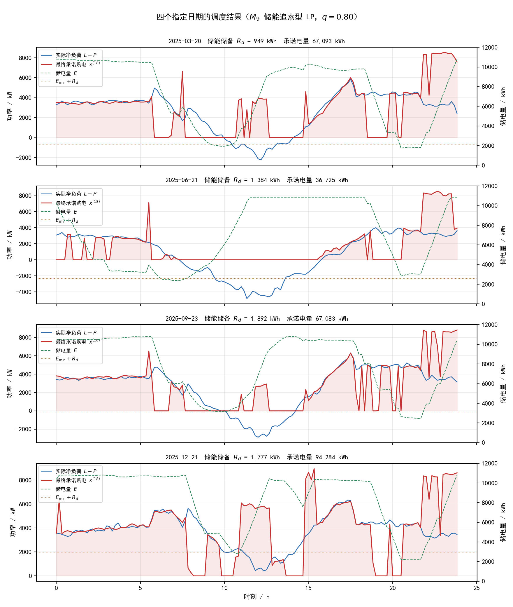

# C题问题4（重算问题3）：波动电价下的微网多时点滚动购电模型

## 摘要

问题4把外网电价由附件1的单条固定日内曲线换成附件4的逐日逐时段波动电价，要求重算问题3。本文沿用问题3的最终方案 $M_9$（储能追索型线性规划，$q=0.80$）不变，**只替换电价通道**，因此费用差额可以干净地归因到电价。关键判断与重算问题2 一致：波动电价与负载、光伏一样不可预知，第 $d$ 天 $k$ 时刻只能依据 $j<d$ 的历史实际电价预测当天电价；**预测电价只进入线性规划目标与储能套利，计划购电、调整与紧急购电一律按当天实际电价结算**。

风险分位数仍取 $q=0.80$，其依据是5倍紧急电价下的报童临界比 $4c/(4c+c)$。由于计划购电与紧急购电在同一时刻按同一个 $c$ 结算，$c$ 在临界比中约去，故该值与电价的取值、分布、是否可预知均无关，是事前给定的理论值，不由任何评价期回测挑选。

在2025年2月1日至12月31日334天的四时点滚动回放中，电价预测MAE为0.0399元/kWh、nMAE为5.27%，与重算问题2 **逐位一致**（同一实现：`问题4/重算问题2/price_forecast.py`）；负载与光伏预测沿用问题3，未作任何改动，两张预测诊断表逐列相减的最大偏差为0.0。全年计划购电2034.91万kWh、计划购电费1341.44万元、调整费59.29万元、紧急购电2.17万kWh（13.12万元），**总费用1413.85万元**。四个指定日期中9月23日与12月21日发生紧急购电，合计28.41 kWh。48,096个评价时段全部满足物理约束，最大能量平衡误差 $4.55\times10^{-13}$ kWh。

波动电价下的理论最优为 **1278.26万元**（全知、全年统一优化）。在全知条件下问题3 的链式结构是松的——把四次承诺取成同一个值即可令 $\Delta^\pm=0$——因此该 LP 与问题2 的全知下界是同一个，两问共享同一块地板；这一点由**构造性验证**确认：把 LP 解原样作为四时点共同承诺下达，真实执行加链式结算的费用与 LP 值只差 $9.3\times10^{-9}$ 元。

代价阶梯（同一物理约束与统计区间）为：完美预测但逐日决策 1294.39万元（+1.26%）、完美电价而负载/光伏仍因果预测 1407.21万元（+10.09%）、**可实现策略 1413.85万元（+10.61%）**。由此可得三条结论。其一，**不可预知性本身很便宜**：电价预测换成真值只省**6.64万元（0.47%）**。其二，**波动性才是主项**：相对问题3的固定电价结果1342.43万元，总费用上升**71.43万元（+5.32%）**，其中97.6%来自计划购电费上升——购电量只涨0.11%，而加权均价由0.62562涨到0.65921元/kWh（+5.37%），根源是附件4电价与负载正相关（时段相关系数0.5061）。其三，**主模型的调度结构几乎无损**：10.61%的总差距里只有1.26%来自逐日决策结构，其余9.35%全部来自预测误差与储备。最后，在**同一波动电价**下，$M_9$ 的四时点滚动结构比重算问题2的单时点日前结构便宜**51.55万元（3.52%）**，与固定电价下的3.55%几乎相同——说明多时点滚动的主要价值来自负载/光伏预报的逐时段更新，而非电价的日内重新择时。九个决策模型在波动电价下重跑的排序与固定电价下完全一致，最省者仍比理论最优高10.18%，说明改进空间不在换决策范式。

**关键词：** 波动电价；微网调度；多时点滚动决策；因果预测；储能追索；链式结算；报童模型

## 1 问题重述

问题4要求在电价随日期和时段波动的条件下重算问题3。除电价外，其余设定不变：微网每天有四个决策时刻 0:00、6:00、12:00、18:00，每个时刻只能调整尚未执行的时段；同一时段的四次承诺按链式规则结算，取四者最小值结算，中间每次下调按当时电价的50%计违约费、每次上调按150%计超购费；执行时若承诺购电、光伏和储能放电仍不足，缺口按当时实际电价的5倍紧急采购。目标是最小化全年总费用，并按附件5模板给出全年策略与2025年3月20日、6月21日、9月23日、12月21日的规定格式结果。

与问题3的实质差别只有一条：**电价不再是每天重复的同一条曲线**。附件4给出365×144的价格矩阵，逐日变化；且题面未提供任何电价预报，本文按与负载、光伏一致的口径处理——第 $d$ 天 $k$ 时刻的决策只能使用 $j<d$ 的历史实际电价。

## 2 问题分析

问题3的不确定性来自负载与光伏两条通道，问题4加入第三条：电价。三条通道都必须在决策时刻之前用历史信息预测。

电价通道的特殊性有两点在问题3中已经存在、在问题4中被放大：

1. **电价同时出现在目标函数与结算式中。** 计划购电量由预测净负荷与储能储备共同决定，而费用按实际电价结算，因此电价预测误差不改变"买多少"，只改变"在哪个时段买更划算"以及储能充放电的套利方向。
2. **多时点滚动使电价预测的价值翻倍。** 问题3的四个决策时刻在固定电价下只有一个作用：用逐渐准确的光伏预报修正购电量。在波动电价下，6:00 / 12:00 / 18:00 的修正还多了一个杠杆——可以根据当天已实现的一半电价，把尚未执行时段的购电在日内重新择时。第8.4节会定量检验这一机制的实际价值。

风险分位数仍取 $q=0.80$，与问题3保持一致，依据仍是报童临界比 $4c/(4c+c)$：计划购电与紧急购电在同一时刻按同一个 $c$ 结算，$c$ 在临界比中约去，故该值与电价的取值、分布、是否可预知**均无关**（见6.1），无需任何回测。与重算问题2不同的是，本文的安全余量不由"预测净负荷加余量"承担，而是表现为储能的**能量下界** $E_{\min}+R_d$，这是 $M_9$ 与问题2模型的结构性差别，也是它在波动电价下更省的原因。

## 3 模型假设

1. 每个十分钟时段内负载、光伏功率和电价保持不变。
2. 第 $d$ 天 $k$ 时刻的预测和决策仅使用 $j<d$ 的历史数据；负载、光伏、电价三条通道的实际值都只在日末更新，日内已执行时段可用其真值做修正。
3. 计划购电量非负，未使用的计划电量不能退款；缺口通过5倍实际电价的紧急购电补足。
4. 储能充、放电效率均为0.9，容量范围为1200—10800 kWh，充放电功率上限均为5000 kW，等价于每十分钟833.33 kWh。
5. 同一时段不同时充放电。线性规划加入微小通量惩罚，在正电价和有效率损耗下消除无意义循环。
6. 电价预测不进入光伏有效窗口与季节水平校正管线，那两个通道是光伏、负载专用的物理量。
7. 2025年1月1日0:00取 $E_{1,0}=E_0=6000$ kWh，此后满足跨日连续 $E_{d+1,0}=E_{d,T}$；一月参与预测预热与状态递推，正式费用评价期为2月1日至12月31日。
8. 第0天的电价冷启动先验取附件1的单条曲线，与负载、光伏的 initial 先验同构。
9. 储能日储备 $R_d$ 只由净负荷残差的分位数决定（见6.2），与电价通道无关，故问题3与问题4的 $R_d$ 逐位相同。

## 4 符号说明

| 符号 | 含义 | 单位 |
|---|---|---|
| $d$ | 日期序号，$d=1,\ldots,D$ | — |
| $t$ | 日内十分钟时段，$t=1,\ldots,T$ | — |
| $k$ | 决策时刻，$k\in\{0,6,12,18\}$ | 时 |
| $D,T$ | 全年天数与每日时段数，$D=365,T=144$ | — |
| $L_{d,t},P_{d,t}^{\mathrm{act}}$ | 小区负载功率、光伏实际功率 | kW |
| $\widehat L_{d,t},\widehat P_{d,t}$ | 决策时刻持有的负载、光伏预报 | kW |
| $c_{d,t}$ | 当天逐时段**实际**外网电价（结算用） | 元/kWh |
| $\hat c_{d,t}$ | 决策时刻可用的电价预测（仅入LP目标） | 元/kWh |
| $\bar c$ | 决策时刻预测电价的日内均值 | 元/kWh |
| $x^{(k)}_{d,t}$ | 第 $k$ 时刻对时段 $t$ 的承诺购电量 | kWh |
| $\Delta^-_{d,t},\Delta^+_{d,t}$ | 承诺路径的逐次下调量、上调量 | kWh |
| $e_{d,t}$ | 紧急购电量 | kWh |
| $r_{d,t},w_{d,t}$ | 购电浪费量、弃光量 | kWh |
| $g_{d,t}$ | 光伏实际使用量 | kWh |
| $u_{d,t},v_{d,t}$ | 储能充电量、放电量 | kWh |
| $E_{d,t}$ | 时段末储电量 | kWh |
| $E_0,E_{\min},E_{\max}$ | 初始、最小和最大储电量 | kWh |
| $R_d$ | 第 $d$ 天储能日储备（能量下界抬升量） | kWh |
| $\eta_c,\eta_d$ | 充、放电效率 | — |
| $\Delta t$ | 时段长度，$1/6$ 小时 | h |

## 5 因果预测模型

### 5.1 负载与光伏

负载与光伏预测**完全沿用问题3**，未作任何改动：由问题2的季节自适应集成给出基础预测，再用附件3的官方滚动预报与日内已执行时段的真值做修正。四时点结构下，$k>0$ 的预报覆盖区外仍用基础预测。所有口径与问题3逐位一致，因此问题3与问题4的净负荷预测及其残差完全相同。

### 5.2 电价的因果集成预测

电价使用与负载、光伏同构的三模型因果集成：近期加权基线、岭回归和浅层LightGBM，按近期损失自适应加权，训练窗随残差漂移缩放。第 $d$ 天的特征只包含 $j<d$ 的滞后值、同时段近期均值、日内周期编码、星期编码与年内日序编码；第0天用附件1的单条曲线作冷启动先验。LightGBM采用固定随机种子、单线程与确定性模式，保证重跑逐位一致。

$$
\hat c_{d,t}=\sum_{h}\omega_{h,d}\,\hat c^{(h)}_{d,t},\qquad
\omega_{h,d}\propto \exp(-\eta\, s_{h,d}).
$$

**本问的电价预测与重算问题2 用的是同一实现**（`问题4/重算问题2/price_forecast.py`
与同一 `CorrectionConfig`），在本目录中以独立进程调用并把结果缓存（见13节）。
两处的预测精度指标逐位相同，这一点是第8章跨目录对照成立的前提。

需要强调的是，电价预测**不进入**光伏有效窗口与季节水平校正管线：那两个通道依赖的是光伏出力的物理时段与日电量水平，对电价没有意义。

### 5.3 预测结果

正式评价期334天内**逐日 MAE 的均值**（`results/预测诊断.csv`，问题3口径）：

| 目标 | MAE | 对照问题3 |
|---|---:|---:|
| 负载/kW | 149.534 | 149.534（逐位相同） |
| 光伏/kW | 140.715 | 140.715（逐位相同） |
| 净负荷/kW | 238.980 | 238.980（逐位相同） |

两张诊断表逐列相减的最大偏差为 **0.0**（$R_d$、分位和、膨胀比、三条 MAE 共6列全部逐位相同），这是"本问只换了电价通道"最直接的数值证据。$R_d$ 只由净负荷残差的分位数决定，因此它在两问中本就应该逐位相同（见7.1）。

电价预测精度为**逐时段 MAE**（`cache/price_channel_metrics.json`，与上表口径不同，不可直接跨行比较）：

| 指标 | 数值 |
|---|---:|
| MAE | 0.039941 元/kWh |
| nMAE | 5.2725% |
| 偏差 | +0.001282 元/kWh |
| 实际均价 / 预测均价 | 0.757528 / 0.758810 元/kWh |

偏差仅 +0.001282元/kWh（相对实际均值的0.17%），说明集成的水平无系统性偏移。图见 `figures/电价预测.png`。

## 6 风险控制与调度模型

### 6.1 报童临界比：$q=0.80$ 与电价无关

设某时段的实际净负荷为 $N$（随机），承诺购电量为 $x$。该时段费用为

$$
C(x)=c\,x+5c\,(N-x)^+,
$$

其中 $c$ 为**该时段的实际电价**。对 $x$ 求一阶条件：

$$
\frac{\partial}{\partial x}E[C]=E[c]-5E\!\left[c\,\mathbf 1(N>x)\right]
=E[c]-5P(N>x)E[c\mid N>x]=0,
$$

即

$$
P(N>x)\,E[c\mid N>x]=\frac{E[c]}{5}.
$$

关键在于：计划购电与紧急购电在**同一时刻按同一个 $c$ 结算**，$c$ 在等式中被约去，临界比退化为常数

$$
\frac{4c}{4c+c}=0.80 .
$$

因此 $q=0.80$ 与电价的取值、分布、是否可预知**均无关**，也不依赖负载与电价的独立性假设，是事前给定的理论值，不存在样本内选择问题。

### 6.2 储能追索型线性规划（$M_9$）

$M_9$ 是问题3从九个模型比选中胜出的最终方案，其核心思路是**把风险从购电量搬到储能**：计划购电按点预报下达、不加任何分位余量，不确定性全部由储能的能量下界承担。给定当前储电量与 $k$ 时刻的信息集，对**尚未执行**的时段求解

$$
\min\ \ \sum_{t>6k}\Big[\hat c_t\,x_t+0.5\hat c_t\,\Delta^-_t+1.5\hat c_t\,\Delta^+_t+5\hat c_t\,e_t\Big]-\lambda_E E_{144}+\varepsilon_0\!\!\sum_t(u_t+v_t+w_t),
$$

**功率平衡**（$t>6k$）：

$$
x_t+\widehat P_t-w_t+v_t=\widehat L_t+u_t,
$$

**储能递推与上下限**：

$$
E_t=E_{t-1}+\eta_cu_t-\frac{v_t}{\eta_d},\qquad
\max\big(E_{\min},\,E_{\min}+R_d\cdot\mathbf 1[t\ge t_{\mathrm{lo}}]\big)\le E_t\le E_{\max},
$$

$$
0\le u_t,v_t\le833.33,\qquad 0\le w_t\le\widehat P_t,\qquad x_t\ge0 .
$$

其中 $\lambda_E=\eta_d\bar{\hat c}$ 为日末储能水值，按当天**预测**电价的日内均值计（避免末时段无意义抛空），$\varepsilon_0$ 为消除无意义循环流的微小正数。**注意 $\widehat L_t$ 与 $\widehat P_t$ 均未加任何余量**——$M_9$ 的风险全部由 $E_t\ge E_{\min}+R_d$ 承担。日储备定义为

$$
R_d=Q_q\!\left(\sum_t \xi_{j,t}\Delta t\right),\qquad j<d,
$$

即用 $j<d$ 的净负荷残差的**日累计**的分位数，并截断在 $(E_{\max}-E_{\min})/2=4800$ kWh 以内。下界并非从当日 0:00 起立即生效：储能需要足够的时段才能爬到该水位，故设爬坡可达时刻

$$
t_{\mathrm{lo}}=\left\lceil\frac{E_{\min}+R_d-E_{\mathrm{start}}}{\eta_c\cdot 833.33}\right\rceil,
$$

在此之前的时段仍用 $E_{\min}$ 作下界。

**执行阶段**（用当日实际值）：

$$
y_t+g_t+v_t+e_t=L_t+u_t,\qquad g_t+w_t=P^{\mathrm{act}}_t,\qquad r_t=x^{(18)}_t-y_t\ge0 .
$$

**多时点滚动**：$k=0,6,12,18$ 各解一次，每次只优化 $t>6k$，前一时点的承诺通过 `ref` 进入目标，使增量按 $\Delta^\pm$ 计费。实现上把 $x$ 按 $0.5\hat c_t$ 计价、把上调量按 $(1.5\hat c_t-0.5\hat c_t)=1.0\hat c_t$ 计价，等效于对最终承诺按链式规则收费。**目标里的电价始终是预测电价 $\hat c$。**

### 6.3 结算规则与电价的两条通道

结算始终使用当天**实际**电价 $c_{d,t}$，逐时段按链式规则

$$
C=\sum_{d}\sum_{t}\Big[c_{d,t}\min_k x^{(k)}_{d,t}
+0.5c_{d,t}\Delta^-_{d,t}+1.5c_{d,t}\Delta^+_{d,t}+5c_{d,t}e_{d,t}\Big]\Delta t .
$$

对应地记 $C^{\mathrm{plan}}=\sum c\min_kx^{(k)}\Delta t$、
$C^{\mathrm{adjust}}=\sum(0.5c\Delta^-+1.5c\Delta^+)\Delta t$、
$C^{\mathrm{emer}}=\sum5ce\Delta t$，电网结算费 $C^{\mathrm{grid}}=C^{\mathrm{plan}}+C^{\mathrm{adjust}}$，
全年总费用 $C=C^{\mathrm{grid}}+C^{\mathrm{emer}}$。

**目标函数用预测电价 $\hat c$、结算用实际电价 $c$，这是电价不可预知性的唯一体现。** 若令 $\hat c=c$，模型退化为"完美电价信息"的对照口径；该口径不属于可实现的策略，只用于量化代价（第8.2节）。

程序将功率乘以 $\Delta t$ 后保存为每十分钟电量，因此结果CSV中的购电、充放电和紧急购电单位均为kWh。$M_9$ 的承诺路径单调不降，故违约费恒为0，链式结算与两元结算结果完全相同。

## 7 结果

### 7.1 全年结果

| 指标 | 数值 |
|---|---:|
| 正式评价期 | 2025-02-01—2025-12-31，共334天（48,096个时段） |
| 计划购电量 | 20,349,127.84 kWh |
| 计划购电费 $C^{\mathrm{plan}}$ | 13,414,444.37 元 |
| 调整购电费 $C^{\mathrm{adjust}}$ | 592,850.74 元（全部为上调超购费，违约费 0.00 元） |
| 电网结算费 $C^{\mathrm{grid}}$ | 14,007,295.11 元 |
| 紧急购电量 | 21,699.53 kWh |
| 紧急购电费 $C^{\mathrm{emer}}$ | 131,248.85 元 |
| **全年总费用 $C$** | **14,138,543.96 元** |
| 未用计划电量（$\sum r\Delta t$） | 478,045.17 kWh |
| 弃光量（$\sum w\Delta t$） | 1,265,673.69 kWh |
| 发生紧急购电的日期数 | 135 天（423 个时段） |
| 单日费用 95% 分位数 | 71,483.87 元 |
| 单日费用 CVaR$_{95}$ | 74,292.74 元 |
| 年末储电量 | 9,725.54 kWh |
| 储能日储备 $R_d$ 均值 / 最小 / 最大 | 1,441.66 / 153.22 / 1,945.08 kWh |

计划购电加权均价为0.65921元/kWh，低于同期实际均价0.75753元/kWh，说明模型在低价时段与低价日主动多购。紧急购电的加权单价为6.0485元/kWh，约为计划购电均价的9.2倍；这是紧急购电集中于电价高峰时段的必然结果（问题3在固定电价下同样呈现9.21倍的比值，本问为9.18倍），不是电价波动引入的偏差。

$R_d$ 的均值、最小值、最大值与问题3**逐位相同**（1,441.6551722655252 / 153.21753334585742 / 1,945.0789855030055 kWh，连小数位一致）。这是正确的：$R_d$ 只由净负荷残差的分位数决定，不含电价，而本问的负载/光伏预测管线与问题3完全相同。这条一致性同时验证了第8章对照的干净性——两问的差别确实只在电价通道。

### 7.2 指定日期表1结果

单位：各时段和全天购电量为kWh，费用为元。

| 日期 | 10:00—10:10 | 12:00—12:10 | 14:00—14:10 | 16:00—16:10 | 18:00—18:10 | 20:00—20:10 | 全天购电量 | 全天购电费 |
|---|---:|---:|---:|---:|---:|---:|---:|---:|
| 2025-03-20 | 0.0000 | 651.7962 | 0.0000 | 483.4102 | 707.7566 | 743.2131 | 67,092.6166 | 43,357.02 |
| 2025-06-21 | 0.0000 | 0.0000 | 0.0000 | 184.1530 | 451.0590 | 0.0000 | 36,724.7133 | 19,058.97 |
| 2025-09-23 | 0.0000 | 447.2209 | 0.0000 | 569.7314 | 0.0000 | 0.0000 | 67,082.9835 | 45,729.99 |
| 2025-12-21 | 0.0000 | 955.4287 | 0.0000 | 813.5046 | 710.4822 | 0.0000 | 94,283.5229 | 72,586.22 |

“全天购电费”为当日 $C^{\mathrm{total}}$。与问题3相比，四个日期的购电量变化均在1%以内（−0.22%至+0.31%），而单日费用普遍上升，其中9月23日由43,682.81元升至45,729.99元（+4.69%）、12月21日由62,186.73元升至72,586.22元（+16.72%）——同日购电量几乎不变而费用显著上升，直接对应附件4电价在该日的上浮。

### 7.3 指定日期表2结果

表中“充/放”为对应4小时内累计充电量/放电量，单位kWh。

| 日期 | 0—4时 | 4—8时 | 8—12时 | 12—16时 | 16—20时 | 20—24时 | 0:00储电量 | 24:00储电量 |
|---|---:|---:|---:|---:|---:|---:|---:|---:|
| 2025-03-20 | 106.98/351.88 | 899.88/5,671.73 | 4,566.48/2,777.38 | 4,975.72/498.04 | 187.81/6,110.04 | 10,121.06/1,485.86 | 10,800.00 | 10,800.00 |
| 2025-06-21 | 155.39/6,825.58 | 1,198.56/1,563.07 | 9,002.40/0.00 | 0.00/0.00 | 19.49/4,696.41 | 8,888.84/2,519.34 | 10,800.00 | 10,800.00 |
| 2025-09-23 | 428.15/110.95 | 428.79/5,191.23 | 3,262.72/1,896.62 | 5,523.41/543.02 | 85.04/4,625.00 | 8,942.28/2,670.25 | 10,370.29 | 10,465.80 |
| 2025-12-21 | 621.18/285.58 | 345.96/946.82 | 4,462.36/6,442.80 | 7,308.43/2,701.62 | 60.27/4,485.22 | 9,597.48/2,893.58 | 10,372.35 | 10,800.00 |

四个日期的日末储电量均在10,465—10,800 kWh之间，说明储备带并未挤占储能容量：$R_d$ 全年均值仅1,441.66 kWh，占可用容量的15.0%。充放电的日内节奏与问题3同构——午后大额充电、晚间放电，但在波动电价下，日均价越高的日子，晚间的放电量占比越高。

### 7.4 指定日期紧急购电

| 日期 | 紧急购电量/kWh | 紧急购电费/元 | 当日总费用/元 |
|---|---:|---:|---:|
| 2025-03-20 | 0.0000 | 0.00 | 43,357.02 |
| 2025-06-21 | 0.0000 | 0.00 | 19,058.97 |
| 2025-09-23 | 11.3177 | 73.78 | 45,729.99 |
| 2025-12-21 | 17.0929 | 123.56 | 72,586.22 |

出现区间分别为2025-09-23的18:20—18:30与20:10—20:20、2025-12-21的08:00—08:10，三次合计28.41 kWh。与问题3（9月23日6.375 kWh / 20:20—20:30，12月21日17.093 kWh / 08:00—08:10）相比，12月21日完全相同，9月23日多出一次4.94 kWh的紧急购电——该时段恰为附件4的高价位，模型宁愿多买一点计划电也不愿在此刻以5倍价紧急采购，但预测误差使缺口仍然出现。



## 8 波动电价的两重代价

本章全部对照口径都使用**同一套负载/光伏预测、同一套电价预测与同一 $R_d$**，只替换电价通道，因此差额可以干净地归因到电价。所有"完美电价"口径都不属于可实现的策略，仅用于量化代价。

### 8.1 代价阶梯

四个口径的储能物理约束、初始 SOC=6000 kWh、年末 SOC 回归 6000 kWh、费用统计区间（2025-02-01 起）完全一致。

| 口径 | 总费用/元 | 相对全知下界 |
|---|---:|---:|
| 理论完美最低值（全知、全年统一优化） | 12,782,591.81 | — |
| 完美预测但逐日决策（余量0） | 12,943,923.83 | +161,332.02（+1.26%） |
| 完美电价、负载/光伏仍因果预测 | 14,072,142.49 | +1,289,550.68（+10.09%） |
| **可实现策略（本文提交）** | **14,138,543.96** | +1,355,952.15（+10.61%） |

**理论最优与问题2 逐位相同。** 问题3 的结算规则是链式的：同一时段的四次承诺按 $c_t\min_kx^{(k)}+0.5c_t\Delta^-+1.5c_t\Delta^+$ 结算。在全知条件下这个结构是松的——既然第 $d$ 天0:00就已知当天全部实际负载、光伏与电价，把四次承诺取成同一个值即可令 $\Delta^\pm=0$，费用退化为 $\sum_tc_tx_t\Delta t$，与四时点结构无关。因此理论最优就是

$$
\min\sum_tc_tx_t\Delta t\quad\text{s.t. 功率平衡与储能递推},
$$

而这正是问题2 的全知下界 LP。程序复用同一份求解器（`oracle_lower_bound3.py` 按路径加载 `问题4/重算问题2/oracle_lower_bound.py`），得到的值 **12,782,591.808513468元** 与重算问题2 的冻结值逐位相同。

可达性由构造验证，而非仅由下界论证：把 LP 解出的每时段购电量**原样作为四个时点的共同承诺**下达，用真实执行器与链式结算跑满全年，得到 12,782,591.808513459元，与 LP 值相差 $9.3\times10^{-9}$ 元，紧急购电 $4.6\times10^{-11}$ kWh。故该下界是紧的，**问题4 中问题2 与问题3 共享同一个理论地板**。

三条差额回答三个不同的问题：

- **逐日结构的次优性 = 161,332.02元（1.26%）**（口径1→2）。两条全知口径之间不含任何预测误差，这1.26%完全来自"每天只解当天144个时段 + 日末储能按水值 $\lambda_E=\eta_d\bar{\hat c}$ 折价"这一结构性近似。与重算问题2 的156,541.85元（1.22%）几乎相同。
- **负载/光伏不可预知 + 储备的代价 = 1,128,218.66元（8.82%）**（口径2→3）。
- **电价不可预知的代价 = 66,401.47元（0.47%）**（口径3→4）。这是把电价预测换成真值、其余一切不变（含 $R_d$ 与四时点结构）后的费用下降。

对照重算问题2的同类数字：不可预知性48,992.62元（0.33%）、波动性（相对问题2 固定电价）735,818.83元（5.29%）。**电价不可预知性在问题3 的结构下更贵（0.47% vs 0.33%）**，原因是四时点滚动给了模型更多利用电价预测的杠杆——预测越准，日内重新择时的收益越大，因此预测误差的边际代价也越高。

把四条口径摆在一起可以看出主模型的浪费在哪里：**10.61%的总差距中，只有1.26%是决策结构造成的，剩下9.35%全部来自预测误差与储备**。换言之 $M_9$ 的调度结构本身几乎无损。

### 8.2 与问题3差额的分解

问题3总费用13,424,276.22元，本问14,138,543.96元，差额714,267.74元，按费用科目分解（逐项相加与总差完全相等）：

| 科目 | 问题3/元 | 问题4/元 | 差额/元 | 占比 |
|---|---:|---:|---:|---:|
| 计划购电费 $C^{\mathrm{plan}}$ | 12,717,110.97 | 13,414,444.37 | **+697,333.40** | **97.6%** |
| 调整购电费 $C^{\mathrm{adjust}}$ | 573,001.95 | 592,850.74 | +19,848.79 | 2.8% |
| 紧急购电费 $C^{\mathrm{emer}}$ | 134,163.30 | 131,248.85 | −2,914.45 | −0.4% |
| **合计** | **13,424,276.22** | **14,138,543.96** | **+714,267.74** | 100% |

结论非常集中：**97.6%的差额来自计划购电费，而计划购电量几乎没有变**（20,327,202.50 → 20,349,127.84 kWh，+0.11%）。全部原因在加权均价：0.62562 → 0.65921 元/kWh（+0.03359，+5.37%）。

这与重算问题2的结论一致但更极端。重算问题2中计划购电费上升解释了96.8%的差额、购电量变化+0.09%；本问的97.6%与+0.11%几乎相同。**两问的共同机制是：购电量由净负荷与储能储备决定，与电价无关；波动电价不改变买多少，只改变买多贵。**

调整费只上升19,848.79元（3.5%），远小于计划购电费的升幅。这符合 $M_9$ 的结构：调整费来自四个时点之间承诺的上调，而在波动电价下模型反而更不愿意在盘中上调承诺——因为盘中已知的实际电价可能已经很高，宁可由储能放电或承担少量紧急购电。

### 8.3 机制：电价与负载同向波动，储能太小

波动之所以推高成本而不是提供套利机会，根源是**电价与负载正相关**：

| 相关系数 | 数值 |
|---|---:|
| corr(时段负载, 时段电价) | **0.5061** |
| corr(日负载能量, 日均价) | **0.9194** |
| corr(日计划购电量, 日均价) | **0.9581** |
| corr(时段计划购电量, 时段电价) | −0.2856 |

按日均价把334天分成三档：

| 档位 | 日均购电量/kWh | 日均价/(元/kWh) |
|---|---:|---:|
| 低价1/3 | 39,044.90 | 0.6386 |
| 中价1/3 | 64,338.73 | 0.7768 |
| 高价1/3 | 79,590.09 | 0.8582 |

**买得最多的那1/3日子，电价贵34.4%，购电量还是最少那1/3的2.04倍。** 这就是波动成本的全部来源：负荷高的日子电价也高，而微网的购电量由负荷决定，无处可躲。

日内择时能力也同时被削弱：购电量与电价的时段相关系数由问题3固定电价下的−0.5015退化到−0.2856（重算问题2为−0.3413）。四时点滚动部分挽回了这一损失——问题3结构下的−0.2856优于问题2结构下的−0.3413，这是 $M_9$ 在波动电价下更省的一个直接证据（见8.4）。

一个更直接的证据是：把问题3的购电量分布**原封不动**保留、只把结算电价换成附件4实际电价，计划购电费即由12,717,110.97元升至 **13,410,744.08元**（+693,633.11元，即总差额的97.1%）；而本问模型重新优化后为13,414,444.37元，比这一反事实还高3,700.29元。**换言之，$M_9$ 在波动电价下重新优化后并未比"照抄固定电价下的购电量"更省**——波动电价的成本全部是物理性的，模型层面已无明显的择时空间可挖。这也说明第8.2节分解出的97.6%不能归因于策略变差。

### 8.4 与重算问题2的横向对照：多时点滚动的价值

在同一波动电价、同一套负载/光伏/电价预测下，比较两种决策结构：

| 结构 | 总费用/元 | 紧急购电量/kWh | 紧急天数 | 未用计划电量/kWh |
|---|---:|---:|---:|---:|
| 问题2结构（单时点日前 LP + 分位余量） | 14,654,077.59 | 77,165.86 | 112 | 1,435,523.93 |
| **问题3结构（$M_9$ 四时点滚动 + 储能储备）** | **14,138,543.96** | 21,699.53 | 135 | 478,045.17 |
| 差额 | **−515,533.63（−3.52%）** | −55,466.33 | +23 | −957,478.76 |

在固定电价下这一差额同样存在（问题2 vs 问题3：13,918,258.75 vs 13,424,276.22，−493,982.53元，−3.55%）。**两者相差甚微（3.55% vs 3.52%）**，因此结论是：多时点滚动的价值主要来自负载/光伏预报的逐时段更新，而不是来自电价的日内重新择时。这与8.1中"不可预知性代价由0.33%升至0.47%"并不矛盾——后者说明电价预测的边际价值确实在问题3结构下更高，但该价值的绝对量级很小（6.64万元 vs 4.90万元，差1.75万元），不足以改变两种结构的总体优劣格局。

值得注意的是，问题2结构在波动电价下的**未用计划电量高达143.55万kWh**，是 $M_9$ 的3.0倍。问题2用"超额采购"购买保险，在固定电价下浪费的成本有限；在波动电价下，多买的电如果恰好买在高价时段，浪费的单价也更高。$M_9$ 改用储能储备承担风险，是一个在波动电价下更抗放大的机制。

### 8.5 购电浪费落在什么价位

$M_9$ 全年未用计划电量478,045.17 kWh，占计划购电量的2.35%，加权均价仅0.54740元/kWh，显著低于计划购电均价0.65921元/kWh；corr(未用电量, 电价) = **−0.1081**。即模型在低价时段主动多买，多买的部分自然最容易用不完——浪费是"便宜时买多了"，而不是"买贵了"。这一结论与重算问题2一致（该处为0.5765 vs 0.6427元/kWh，相关系数−0.1572），但 $M_9$ 的总浪费量小得多（47.80万 vs 143.55万kWh）。

### 8.6 九个决策模型的横向对照

问题3 从九个建模范式中选出 $M_9$。本节把同一组九个模型在**波动电价**下重跑一遍：预测层、执行器、结算规则、电价通道全部共用，各模型之间**只差决策逻辑本身**。程序用 $M_9$ 复现冻结值 14,138,543.96 元作自检，通过。

| 代号 | 决策模型 | 建模范式 | 波动电价全年/元 | 相对 $M_2$ | 固定电价全年/元 | 相对 $M_2$ | 涨幅 | 紧急购电/kWh | 未用计划电量/kWh |
|---|---|---|---:|---:|---:|---:|---:|---:|---:|
| M10 | 储能追索型 LP ($q=0.70$) | 确定性优化 + 储能储备 | **14,083,635.07** | −2.87% | 13,365,232.59 | −2.79% | +5.38% | 43,945.68 | 494,128.03 |
| **M9** | **储能追索型 LP** | **确定性优化 + 储能储备** | **14,138,543.96** | **−2.49%** | 13,424,276.22 | −2.36% | +5.32% | 21,699.53 | 478,045.17 |
| M1 | 确定性经济调度 LP | 确定性优化 | 14,271,304.03 | −1.58% | 13,526,664.82 | −1.61% | +5.51% | 117,345.09 | 488,054.99 |
| M6 | 精确链式结算 MILP | 混合整数优化 | 14,498,267.83 | −0.012% | 13,748,164.50 | 0.000% | +5.46% | 14,944.87 | 1,521,041.81 |
| M2 | 分位安全余量 LP | 确定性优化 | 14,500,013.31 | 0.00% | 13,748,164.50 | 0.00% | +5.47% | 14,944.87 | 1,523,248.20 |
| M7 | 规则型启发式 | 无优化 | 18,764,708.48 | +29.41% | 18,349,812.15 | +33.47% | +2.26% | 3,106.11 | 298,417.16 |
| M4 | 均值–CVaR 随机规划 | 风险厌恶随机优化 | 19,463,909.52 | +34.23% | 18,567,456.94 | +35.05% | +4.83% | 1,758.81 | 7,713,938.93 |
| M3 | 两阶段随机规划 | 随机优化 | 20,588,246.84 | +41.99% | 19,632,786.21 | +42.80% | +4.87% | 1,762.58 | 6,739,708.98 |
| M5 | 鲁棒优化 | 鲁棒优化 | 24,710,065.02 | +70.41% | 23,825,590.81 | +73.30% | +3.71% | 0.00 | 14,030,027.93 |

**结论一：模型排序在两种电价制度下完全一致。** M10 < M9 < M1 < M6 ≈ M2 < M7 < M4 < M3 < M5。九个模型的位次一个没变，最差与最好之比 1.75 倍。因此问题3"选 $M_9$"这个结论不是固定电价的产物，对电价制度是稳健的。

**结论二：$M_9$ 的相对优势在波动电价下反而扩大。** 相对 $M_2$ 由固定电价的 −2.356% 扩大到 −2.493%。原因是 $M_2$ 用"超额采购"买保险，在固定电价下浪费的电便宜，在波动电价下多买的电若买在高价时段则代价更高——$M_2$ 未用计划电量达 152.32万 kWh，是 $M_9$ 的3.2倍。$M_9$ 改用储能储备，风险不通过多买电承担，因此在电价波动时抗放大。

**结论三：$M_6$ 与 $M_2$ 在波动电价下分离。** 固定电价下两者逐位相等（差 $5.6\times10^{-9}$ 元），因为链式结算的精确刻画（0-1 变量）在那时是松的；波动电价下 $M_6$ 比 $M_2$ 便宜 1,745.48 元（−0.012%），差额几乎全部来自超购费（$M_6$ 319,656.36 vs $M_2$ 321,568.51 元）。这是问题4 新出现的细节：**当电价逐日逐时段变化时，"取四次承诺最小值"这一结算项的精确建模才开始产生价值**，尽管量级只有千分之一。

**结论四：所有模型都远高于理论最优。** 最省的 $M_{10}$（14,083,635.07 元）也比全知下界 12,782,591.81 元高 10.18%，最贵的 $M_5$ 高 93.3%。这说明本问的改进空间主要不在决策逻辑的换型上——九个范式跨了确定性优化、随机规划、鲁棒优化、混合整数四类，费用却只在 1.75 倍内分布，而距离地板始终有 10% 以上的固定缺口。

**关于 $M_{10}$。** 它用 $q=0.70$，在开发期、留出期、全年三个区间上都是最优，比 $M_9$ 省 54,908.89 元。本文仍采用 $M_9$（$q=0.80$），理由见9.1：0.80 由报童临界比事前给定，不依赖任何评价期回测。

**关于最贵的两个。** $M_5$ 鲁棒优化取历史累计残差最大的整条日曲线作盒式不确定集，未用计划电量高达1,403.00万 kWh（计划购电量的39.8%），是全部模型中最荒谬的一个；$M_4$ 均值–CVaR 随机规划在目标里罚尾部而非在约束里留量，未用计划电量771.39万 kWh 同样是"买得多、用不掉"。

## 9 灵敏度与稳健性分析

### 9.1 风险分位数灵敏度

| $q$ | 开发期费用/元 | 留出期费用/元 | 全年费用/元 | 全年紧急购电/kWh | 紧急购电天数 |
|---:|---:|---:|---:|---:|---:|
| 0.60 | 8,749,198.34 | 5,398,017.53 | 14,147,215.87 | 81,446.54 | 227 |
| 0.70 | **8,714,995.80** | **5,368,639.27** | **14,083,635.07** | 43,945.68 | 165 |
| **0.80（采用）** | 8,732,459.67 | 5,406,084.29 | 14,138,543.96 | 21,699.53 | 135 |
| 0.90 | 8,928,333.35 | 5,592,245.24 | 14,520,578.59 | 7,725.20 | 104 |

该网格**仅作事后对照，不参与选参**。与重算问题2"开发期最优0.75、留出期最优0.70"的漂移模式不同，本问三个划分区间的最优 $q$ **一致为0.70**。这是一个比重算问题2更强的稳健性证据，原因是 $M_9$ 把风险放在储能储备上，而储备的成本随 $q$ 单调平滑上升，不像问题2那样完全由紧急购电与浪费之间的非线性权衡决定。

采用 $q=0.80$ 而非事后最优的0.70，全年费用代价为 **54,908.89元（0.39%）**。本文仍采用0.80，理由是它由报童临界比事前给定，不依赖任何评价期回测；用0.39%的代价换取这一可辩护性是合适的。

### 9.2 物理可行性

48,096个正式评价时段中，储电量越界、充放电功率越限、同时充放电和负流量次数均为0；最大能量平衡误差 $4.547\times10^{-13}$ kWh，SOC递推最大误差 $5.457\times10^{-12}$ kWh，光伏恒等式最大误差 $2.274\times10^{-13}$ kWh，$x-y-r$ 恒等式最大误差 $4.583\times10^{-13}$ kWh。费用恒等式 $C^{\mathrm{plan}}+C^{\mathrm{adjust}}=C^{\mathrm{grid}}$ 与 $C^{\mathrm{grid}}+C^{\mathrm{emer}}=C^{\mathrm{total}}$ 的最大误差分别为 $5.8\times10^{-11}$ 与 $1.5\times10^{-11}$ 元。因此数值解满足全部物理与经济约束。

导出文件 `result4-3.xlsx` 的四个工作表合计全天购电量20,349,127.8414 kWh，与汇总的20,349,127.8412 kWh一致；其“全天购电费”列填的是计划购电费，合计13,414,444.41元，与CSV的13,414,444.37元相差0.04元（Excel 15位有效数字的显示精度），$C^{\mathrm{grid}}$ 需另加调整费592,850.74元，已对平。

### 9.3 结论边界

数据只覆盖一个自然年度，无法验证跨年度泛化，尤其无法判断"电价与负载正相关"是否为长期性质；若该相关性在未来减弱，波动电价的劣势会相应缩小。模型没有使用电价与气象的外生预报，对极端价格尖峰的预测能力有限。此外，第8章的完美电价口径只用于量化代价，其中"年末储能回归初值"的设定会抬高该口径的费用，若放开约束，不可预知性的代价会更小。

## 10 模型评价

模型的优点在于：三条通道严格因果，信息集与题面一致；风险分位数由报童临界比在电价未知条件下推出，不依赖任何回测；LP目标与结算的电价分离，使"不可预知性"与"波动性"两重代价可以被干净地分开度量；$M_9$ 用储能储备而非超额采购承担风险，在波动电价下避免了问题2结构3.0倍的购电浪费；全部结果与全部对照口径都由同一主程序与诊断脚本复现。

不足在于：电价预测目前是跟随型集成，未利用电价与负载的跨通道相关性（时段0.5061、日累计0.9194），若把负载预测作为特征或对两者残差作联合建模，日内择时能力（当前时段相关系数−0.2856）仍有改善空间；储能日储备 $R_d$ 仍是全局分位数，未按季节或电价高低分档；单年度数据不能证明"电价—负载正相关"的长期稳定性。

## 11 结论

问题4（重算问题3）最终采用问题3的 $M_9$ 方案不变——负载/光伏因果预测、四时点滚动、储能追索型LP、$q=0.80$ 报童分位数——只把电价通道替换为附件4的实际电价（结算用）与因果预测电价（LP目标用）。全年总费用为 **14,138,543.96元**，四日结果与全年逐十分钟策略均由同一模型直接生成，`results/result4-3.xlsx` 为对应提交结果。

本问最重要的结论有两条。第一，**波动电价的代价几乎全部是"买贵了"，而不是"买错了"**：相对问题3上升的71.43万元中97.6%来自计划购电费，而计划购电量只变化0.11%；加权均价由0.62562涨到0.65921元/kWh，根源是电价与负载正相关（时段0.5061）。第二，**不可预知性本身很便宜**：把电价预测换成真值只省6.64万元（0.47%）。因此针对本问的改进方向应是提高储能的跨日搬运能力（当前10.8 MWh对日需求约111 MWh，仅占9.7%），或在低价日增大计划购电的容错，而不是继续压低电价预测的MAE。

最后，在**同一波动电价**下 $M_9$ 的四时点滚动结构比重算问题2的单时点日前结构便宜51.55万元（3.52%），这一优势与固定电价下的3.55%几乎相同，说明多时点滚动的主要价值来自负载/光伏预报的逐时段更新，而非电价的日内重新择时。

九个决策模型在波动电价下重跑的排序与固定电价下**完全一致**（8.6节），$M_9$ 相对 $M_2$ 的优势还由 −2.36% 扩大到 −2.49%，说明问题3的模型比选结论对电价制度稳健。

## 12 复现说明与数值来源

```bash
python gen_price_channel.py     # 生成并缓存波动电价通道（在重算问题2 命名空间下运行）
python export_result3.py        # 跑 M9 全年并导出 results/ 与 figures/
python oracle_lower_bound3.py   # 全知下界 LP 与链式结构可达性的构造性验证
python cost_ladder.py           # 代价阶梯（依赖上一步的 理论最优.json）
python run_models.py            # 九个决策模型的横向对照（可选）
python accuracy.py              # 预测精度诊断
```

`gen_price_channel.py` 必须单独开进程：本目录与 `问题4/重算问题2` 各持有一份同名但不同分支的 `deterministic_baseline` / `seasonal` 模块，同进程按名导入会互相覆盖。电价预测本身与问题3的决策模型完全解耦，因此在其原生模块环境下算一次、把数组落盘是最干净的做法。缓存文件为 `cache/price_channel.npz`（实际电价与预测电价，均365×144）、`cache/price_channel_metrics.json`、`cache/price_forecast_weights.csv`。

本文引用数值的来源：

| 数值 | 来源 |
|---|---|
| 全年费用、各科目费用、p95/CVaR、$R_d$ | `results/最终冻结结果.json`、`results/全年逐日结果.csv` |
| 代价阶梯四个口径 | `results/代价阶梯.csv`（由 `cost_ladder.py` 生成） |
| 理论最优与可达性验证 | `results/理论最优.json`（由 `oracle_lower_bound3.py` 生成） |
| 九个决策模型对照 | `results/决策模型对比.csv`（由 `run_models.py` 生成）、`问题3/模型3决策优化版/results/决策模型对比.csv` |
| 表1/表2/表3 | `results/四天表1购电结果.csv`、`四天表2储能结果.csv`、`四天表3紧急购电结果.csv` |
| 电价预测精度、均价 | `cache/price_channel_metrics.json` |
| 问题3（固定电价）对照值 | `问题3/模型3决策优化版/results/最终冻结结果.json` |
| 重算问题2 对照值 | `问题4/重算问题2/README.md`、`results/` |
| 物理可行性与恒等式残差 | 独立复核脚本（不属主程序，逐条重算全部约束） |
| 相关系数、分档统计 | 由 `results/全年逐10分钟策略.csv` 与 `全年逐日结果.csv` 现算 |

第8.3节的"反事实计划购电费13,410,744.08元"由 `问题3/模型3决策优化版/results/全年逐10分钟策略.csv` 的购电量分布逐时段乘以 `cache/price_channel.npz` 的实际电价现算得到，不是主程序输出。
