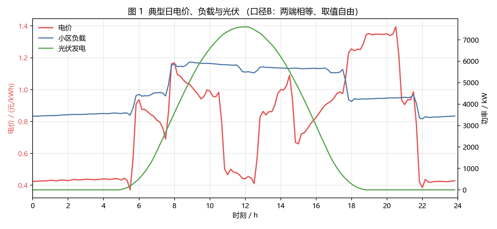
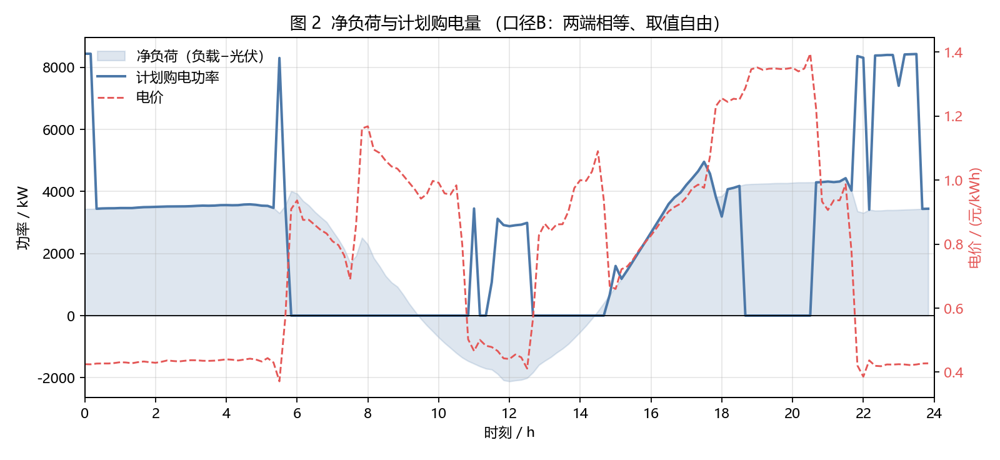
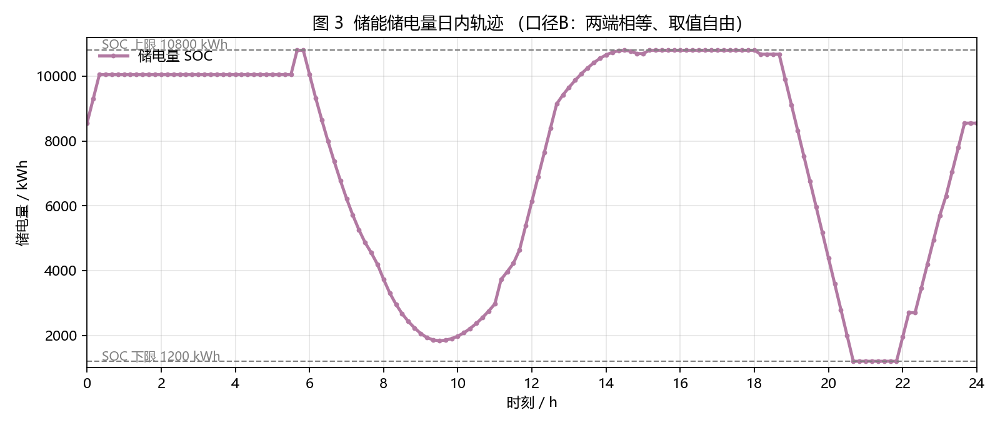
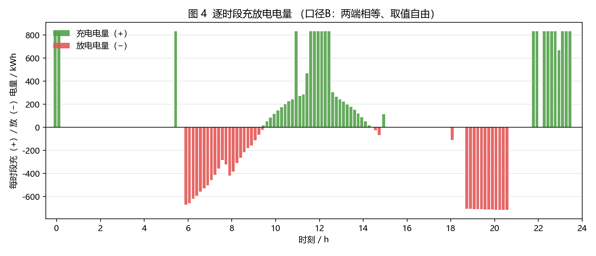
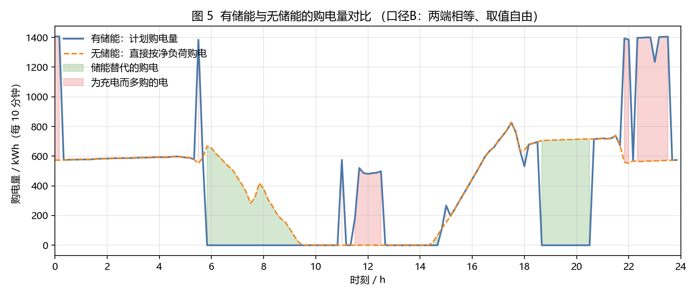

# 问题一：典型日微网购电与储能调度模型（模型 B · 日循环两端相等、取值自由）

---

## 1 问题分析

本问给定典型日的电价、小区负载与光伏发电预测功率，要求在储能设备的功率、
容量与效率约束下，制定每 10 分钟一个时段的购电与充放电计划，
使全天购电费用最小，并满足储能设备在 0:00 与 24:00 的储电量相同。

问题的经济学本质是**电价套利**：在电价低的时段多买电存入储能，
在电价高的时段放电供给负载以减少高价购电。约束的难点集中在三处：
储能充放电存在往返效率损耗、储电量必须维持在规定区间内、充放电功率有上限。

由于决策变量全部连续、目标函数与约束条件全部线性，该问题属于标准线性规划，
可由单纯形法或内点法求得全局最优解，不存在陷入局部最优的风险。

---

## 2 模型假设

1. 光伏发电优先供给小区负载，富余电量不能上网，只能充入储能或弃掉，弃光不产生收益。
2. 储能的充电效率与放电效率各为 90%，按单程理解，往返效率为 $0.9\times0.9=0.81$。
3. 每个 10 分钟时段内功率保持不变，电量 = 功率 × $\Delta t$，$\Delta t=1/6$ h。
4. 典型日的电价、负载与光伏在 144 个时段内按附件 1 给定，视为确定量。
5. **日循环只要求两端相等，共同取值由优化决定**。题面仅规定"储能设备在 0:00 和
   24:00 的储电量相同"，未规定该共同值必须等于多少，故不把 6000 kWh 作为硬约束。

---

## 3 符号说明

| 符号 | 含义 | 单位 |
|---|---|---|
| $t$ | 日内 10 分钟时段序号，$t=1,\dots,T$，$T=144$ | — |
| $\Delta t$ | 时段时长 | h |
| $c_t$ | 第 $t$ 时段外网电价 | 元/kWh |
| $L_t$ | 第 $t$ 时段小区负载功率 | kW |
| $P_t^{\text{fc}}$ | 第 $t$ 时段光伏发电预测功率 | kW |
| $x_t$ | 计划购电功率（决策变量，$x_t\ge0$） | kW |
| $u_t$ | 储能充电功率（决策变量，$0\le u_t\le P_{\text{st}}^{\max}$） | kW |
| $v_t$ | 储能放电功率（决策变量，$0\le v_t\le P_{\text{st}}^{\max}$） | kW |
| $w_t$ | 弃光功率（决策变量，$w_t\ge0$） | kW |
| $E_t$ | 第 $t$ 时段末储电量（状态变量） | kWh |
| $E_{\min},E_{\max}$ | 储电量下限与上限，1200 与 10800 | kWh |
| $P_{\text{st}}^{\max}$ | 最大充放电功率，5000 | kW |
| $\eta_c,\eta_d$ | 充电、放电效率，均为 0.90 | — |

---

## 4 模型建立

### 4.1 目标函数

$$
\min_{x,u,v,w}\ C=\sum_{t=1}^{T}c_tx_t\Delta t
$$

### 4.2 约束条件

**(1) 电量平衡**（$t=1,\dots,T$）

$$
x_t+P_t^{\text{fc}}+v_t=L_t+u_t+w_t
$$

左侧为供给（外网购电、光伏出力、储能放电），右侧为去向（小区负载、储能充电、弃光）。
题目要求"微网提供的电能不可低于小区负载"，光伏富余又不能上网，
故引入 $w_t\ge0$ 作为松弛。由于目标函数中 $x_t$ 的系数为正，
求解过程会自动将购电量压至最低，从而自动满足供电不低于负载的硬约束。

**(2) 储能动态**（$t=1,\dots,T$）

$$
E_t=E_{t-1}+\eta_cu_t\Delta t-\frac{v_t\Delta t}{\eta_d}
$$

**(3) 储电量范围**（$t=1,\dots,T$）

$$
E_{\min}\le E_t\le E_{\max}
$$

**(4) 日循环（两端相等，取值自由）**

$$
E_T=E_0
$$

本模型只要求两端相等，共同取值由优化决定，仅需落在 $[E_{\min},E_{\max}]$ 内。
含义是把这一天看成纯粹的循环调度周期，考察储能容量的充分套利潜力。

**(5) 变量取值范围**

$$
x_t\ge0,\qquad 0\le u_t\le P_{\text{st}}^{\max},\qquad
0\le v_t\le P_{\text{st}}^{\max},\qquad w_t\ge0
$$

### 4.3 完整模型

$$
\begin{aligned}
\min\quad & C=\sum_{t=1}^{T}c_tx_t\Delta t\\
\text{s.t.}\quad
& x_t+P_t^{\text{fc}}+v_t=L_t+u_t+w_t, && t=1,\dots,T\\
& E_t=E_{t-1}+\eta_cu_t\Delta t-\frac{v_t\Delta t}{\eta_d}, && t=1,\dots,T\\
& E_{\min}\le E_t\le E_{\max}, && t=1,\dots,T\\
& E_T-E_0=0, &&\\
& x_t\ge0,\quad 0\le u_t,v_t\le P_{\text{st}}^{\max},\quad w_t\ge0, && t=1,\dots,T
\end{aligned}
$$

### 4.4 模型性质

与固定端点的版本相比，本模型**少一条等式约束**（把 $E_0=6000$ 与 $E_T=6000$
两条并作 $E_T-E_0=0$ 一条），可行域更大。

**推论**：固定端点版本（模型 A）的任意可行解在本模型中均可行
（取 $E_0=E_T=6000$ 即可），因此本模型的最优费用必然**不高于**模型 A。
这一关系在灵敏度分析中得到数值验证。

充放互斥同样无需额外约束：往返效率 $0.81<1$，
同时充放会使储电量凭空净增，不可能是最优解。

---

## 5 模型求解

模型用 Python 的 `scipy.optimize.linprog` 调用开源求解器 **HiGHS** 求解，
约束矩阵按稀疏格式组装。求解状态为 `Optimal`，**耗时 0.009 秒**。

---

## 6 结果与分析

### 6.1 关键指标

| 指标 | 数值 |
|---|---|
| 全天购电量 | 59482.6990 kWh |
| 全天购电费 | 35118.5986 元 |
| 平均购电价 | 0.5904 元/kWh |
| 充电总量 | 20740.6661 kWh |
| 放电总量 | 16799.9396 kWh |
| 往返损耗 | 3940.7266 kWh |
| 弃光电量 | 0 kWh |
| 0:00 / 24:00 储电量 | **8550 / 8550 kWh** |
| 无储能基准购电费 | 48052.0466 元 |
| 储能带来的节省 | 12933.4480 元（26.92%） |

**优化给出的日循环储电量为 8550 kWh**，高于附录 1 给出的初始值 6000 kWh。
含义是：在电价每年相同的典型日里，把储电量的循环工作点抬高到 8550 kWh
可以略微增加套利空间——起点更高，凌晨就有更多余量在高价时段放电，
傍晚再补回同样的水平。

### 6.2 论文表 1 指定时段购电量

| 时间段 | 购电量/kWh |
|---|---:|
| 10:00–10:10 | 0.0000 |
| 12:00–12:10 | 486.4029 |
| 14:00–14:10 | 0.0000 |
| 16:00–16:10 | 394.9315 |
| 18:00–18:10 | 636.9826 |
| 20:00–20:10 | 0.0000 |
| **全天购电量** | **59482.6990** |
| **全天购电费** | **35118.5986 元** |

与固定端点版本相比，这六个指定时段的购电量完全相同——差异出现在其它时段。

### 6.3 论文表 2 分时段充放电量

| 时间段 | 充电量/kWh | 放电量/kWh |
|---|---:|---:|
| 0:00–4:00 | **1666.6667** | 0.0000 |
| 4:00–8:00 | 833.3333 | 6365.8412 |
| 8:00–12:00 | 4787.9643 | 1702.9970 |
| 12:00–16:00 | 5286.0352 | 91.1014 |
| 16:00–20:00 | 0.0000 | 5780.1319 |
| 20:00–24:00 | **8166.6667** | 2859.8681 |
| 0:00 储电量 | 8550.0000 | — |
| 24:00 储电量 | 8550.0000 | — |

把这张表与模型 A 对比，可以发现两处明显差别：凌晨 0:00–4:00 的充电量
从 4500 降到 1666.67 kWh，而 20:00–24:00 的充电量从 5333.33 升到 8166.67 kWh。
原因是起点储电量抬到 8550 后，凌晨充电的余量变小，而放电量不变，
于是改到电价同样低廉的深夜时段补足——总充电量 20740.6661 kWh 与模型 A 完全相同。

### 6.4 图示

储电量轨迹在 1200 与 10800 kWh 之间摆动，**没有贴住上下限**。
注意轨迹的起止点都落在 8550 kWh 而不是 6000 kWh。

无储能时全天需购电 61789.9354 kWh、花费 48052.0466 元；
配置储能后购电费降至 35118.5986 元，**节省 12933.4480 元，降幅 26.92%**。

---

## 7 模型检验

| 检验项 | 结果 |
|---|---|
| 电量平衡残差最大值 | $0.0$ kW |
| 储能动态残差最大值 | $0.0$ kWh |
| 储电量最小值 / 最大值 | 1200 / 10800 kWh（未越界） |
| 同一时段充放电重叠最大值 | 0.0 kW |
| 变量是否出现负值 | 否 |
| 日循环 $\lvert E_T-E_0\rvert$ | 0.0 kWh |

同样可以用"充放电量之比恒为 0.81"作为独立自检：由 $E_T=E_0$ 推出
$\sum v_t\Delta t/\sum u_t\Delta t=\eta_c\eta_d=0.81$，
实测 $16799.9396/20740.6661=0.81$。

---

## 8 灵敏度分析：与固定端点口径的对比

把日循环端点从"固定 6000"改为"取值自由"，模型结构不变、只少一条等式约束，
结果如下：

| 项目 | 模型 A（固定 6000） | 模型 B（取值自由） | 差异 |
|---|---:|---:|---:|
| 循环储电量 | 6000 kWh | 8550 kWh | +2550 |
| 全天购电量 | 59482.6990 kWh | 59482.6990 kWh | 0 |
| 全天购电费 | 35126.9486 元 | 35118.5986 元 | −8.35 元 |
| 平均购电价 | 0.5905 元/kWh | 0.5904 元/kWh | −0.0001 |
| 充电总量 | 20740.6661 kWh | 20740.6661 kWh | 0 |
| 放电总量 | 16799.9396 kWh | 16799.9396 kWh | 0 |
| 储能节省比例 | 26.8981% | 26.9155% | +0.0174 个百分点 |

**费用的下降幅度只有 8.35 元，占万分之二点四**，且全部来自购电时间的重新分配，
购电量与充放电总量完全相同。这说明该问题的结论对日循环端点口径高度不敏感。

从可行性关系上看，这一结果也在预期之内：模型 A 的可行域是模型 B 的子集，
所以放宽端点只会让最优费用持平或略降；而实际的下降幅度很小，
说明把循环工作点从 6000 抬到 8550 并没有带来实质性的套利增益。

---

## 9 模型评价

**优点**：模型是凸的线性规划，解为全局最优；日循环只保留"两端相等"这一条
题面明确要求的约束，不额外引入题面未规定的数值假设；求解速度更快
（0.009 秒，约为固定端点版本的 1/4）。

**局限**：优化得到的循环储电量 8550 kWh 高于实际初始状态 6000 kWh，
相当于假设计划开始时电池里比实际多 2550 kWh。该计划作为"典型日循环调度"
的抽象模型是自洽的，但如果要直接拿到现场执行，需要先补足电量差额。

**与模型 A 的关系**：两个模型的关系是严格的可行域包含关系，
本模型是模型 A 的松弛。若论文目标是"给出可直接执行的计划"，
建议以模型 A 为主；若目标是"考察储能容量的充分利用潜力"，
则以模型 B 为主，并把模型 A 作为对照。
